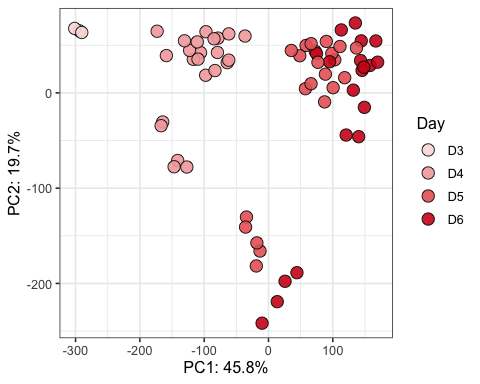
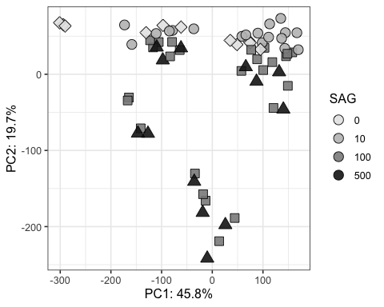
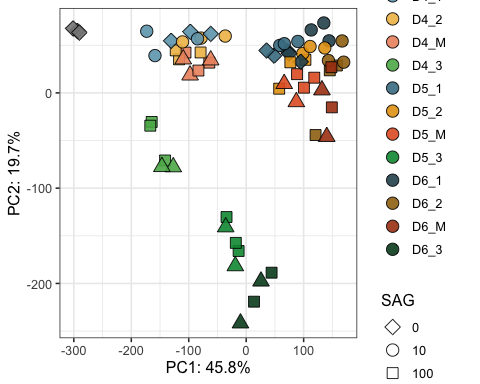
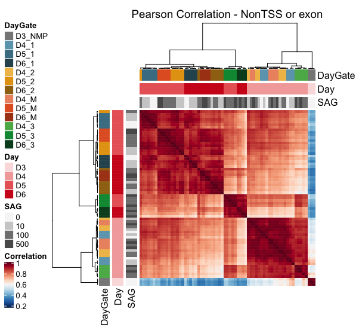
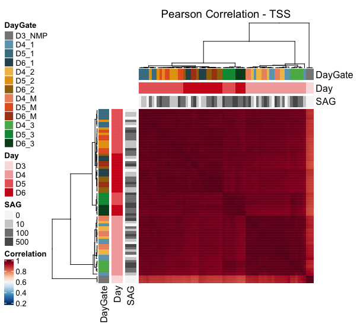

CaTS-ATAC PCA and correlation heatmaps
================

# ATAC analysis

``` r
rm(list=ls())

library(DESeq2)
library(RColorBrewer)
library(tidyverse)
library(ComplexHeatmap)
library(circlize)
```

### Set dirs

``` r
workingdir="/Users/delasj/Documents/BriscoeLab/project_DV_ATAC_reproduce_analysis/"
subworkinput="inputs_cats-atac_2_pca_heatmap/"
outdir="outputs_cats-atac_2/"

ifelse(!dir.exists(file.path(workingdir,outdir)), dir.create(file.path(workingdir,outdir)), "Directory exists")
```

    ## [1] TRUE

## Load data

Counts table and annotation generated by nf-core/atacseq in:
`cats_atac/results/bwa/mergedLibrary/macs/broadPeak/consensus/` Further
elements filtered with `cats-atac_1_filter_fdr.Rmd`

``` r
#counts table
count.table <- read.table(file=paste0(workingdir,subworkinput,"consensus_peaks.mLb.clN.featureCounts.txt"),header=TRUE, stringsAsFactors = FALSE)

# fdr per sample and interval - if peak overalapped
fdr.table <- read.table(file=paste0(workingdir,"/outputs_cats-atac_1/consensus_peakfdr_filtered.csv"), header=TRUE, stringsAsFactors = FALSE)

# clean colnames
colnames(count.table) <- gsub(".mLb.clN.bam","",colnames(count.table))

# we do not need coordinates
count.table <- count.table %>%
  select("Geneid", starts_with("D"))

#keep only the filtered intervals
count.table <- count.table %>%
  filter(Geneid %in% fdr.table$interval_id)


## Annotation table
ann.table <- read.table(file=paste0(workingdir,subworkinput,"consensus_peaks.mLb.clN.annotatePeaks.txt"), header=TRUE, stringsAsFactors = FALSE, sep = "\t")
colnames(ann.table)[1] <- "Peakid"


ann.table.clean <- ann.table %>% 
  select(c("Peakid","Chr","Start","End","Strand","Annotation","Distance.to.TSS","Nearest.PromoterID")) %>%
  separate(Annotation, into = "Annotation_brief", sep = " ", remove = FALSE)
```

    ## Warning: Expected 1 pieces. Additional pieces discarded in 74172 rows [1, 2, 3,
    ## 4, 5, 6, 7, 9, 10, 11, 13, 15, 17, 22, 26, 27, 31, 35, 37, 38, ...].

## Colors and shapes

``` r
sorted.DayGate <- c("D3_NMP","D4_1","D4_2","D4_M","D4_3",
                    "D5_1","D5_2","D5_M","D5_3",
                    "D6_1","D6_2","D6_M","D6_3")
colorJD <- c("#878787","#6da4ba","#f0be56","#ec936f","#5bb357",
             "#477d92","#e5a114","#e3602b","#009640",
             "#2e525e","#9f7113","#ab4117","#044a23")
shapes4_manual = c(18,15,16,17) # these are block
shapes5_manual = c(25,21,22,23,24) # these are filled
shapes4_fill_manual = c(23,21,22,24)

# for Days
red_colors <- c("#fadede","#f3aaaa","#e96666","#cf1e1e")

# for SAG
grey_colors <- c("#f6f6f6","#cecece","#808080","#595959")
```

## Differential analysis

``` r
count.matrix <- count.table %>%
  column_to_rownames("Geneid")

## Make metadata file for DESeq

genecolData_first <- data.frame(Sample_ID = colnames(count.matrix))
genecolData_first <- genecolData_first %>% 
  separate(Sample_ID,into=c("Day","SAG","Gate","Rep"), sep="_", remove=FALSE) %>%
  mutate(Condition=paste(Day,SAG,Gate, sep="_"),
         DaySAG=paste(Day,SAG,sep = "_"),
         DayGate=paste(Day,Gate,sep="_"),
         Experiment=paste(SAG,Rep,sep="_"))
genecolData_first <- as.data.frame(unclass(genecolData_first))


dds <- DESeqDataSetFromMatrix(countData = count.matrix,
                              colData = genecolData_first,
                              design = ~ Gate)

dds <- DESeq(dds)
```

    ## estimating size factors

    ## estimating dispersions

    ## gene-wise dispersion estimates

    ## mean-dispersion relationship

    ## final dispersion estimates

    ## fitting model and testing

    ## -- replacing outliers and refitting for 29 genes
    ## -- DESeq argument 'minReplicatesForReplace' = 7 
    ## -- original counts are preserved in counts(dds)

    ## estimating dispersions

    ## fitting model and testing

``` r
vsd <- varianceStabilizingTransformation(dds,blind = FALSE)
```

## Export files

Useful for ploting heatmaps elsewhere

``` r
# Export normalized tables for plotting elsewhere
dds_counts <- counts(dds, normalized = TRUE)
vsd_data <- assay(vsd)

write.table(dds_counts, file = paste0(workingdir,outdir,"consensus_peaks.mLb.clN.normCounts.txt"), quote = FALSE, row.names = TRUE)
write.csv(vsd_data, file = paste0(workingdir,outdir,"/consensus_peaks.mLb.vsd.csv"), quote = FALSE)
```

## Plot PCAs

``` r
# calculate the variance for each gene
rv <- rowVars(vsd_data)
# select the ntop genes by variance
ntop=30000
select <- order(rv, decreasing=TRUE)[seq_len(min(ntop, length(rv)))]

t_vsd <- t(vsd_data[select,])
vsd_pca <- prcomp(t_vsd, retx=TRUE, scale. = FALSE)
#summary(vsd_pca)

#names(vsd_pca)

# How many PC to explain enough variance?
#summary(vsd_pca)

var_explained <-vsd_pca$sdev^2/sum(vsd_pca$sdev^2)
#plot(var_explained)

vsd_pca_plot <- vsd_pca$x %>% 
  as.data.frame %>%
  rownames_to_column("Sample") %>%
  separate(Sample,into=c("Day","SAG","Gate","Rep"), sep="_", remove=FALSE) %>%
  mutate(Condition=paste(Day,SAG,Gate, sep="_"),
         DaySAG=paste(Day,SAG,sep = "_"),
         DayGate=paste(Day,Gate,sep="_"),
         Experiment=paste(SAG,Rep,sep="_"),
         DayGate = factor(DayGate, levels = sorted.DayGate)) 


ggplot(vsd_pca_plot, aes(x=-PC1,y=PC2,fill=Day)) +
  scale_fill_manual(values = red_colors) +
  geom_point(size=4, alpha=0.9, shape=21) +
  guides(fill = guide_legend(override.aes=list(shape=21))) +
  #scale_shape_manual(values = shapes4_fill_manual) +
  labs(x=paste0("PC1: ",round(var_explained[1]*100,1),"%"),
       y=paste0("PC2: ",round(var_explained[2]*100,1),"%")) +
  theme_bw(base_size=12)
```

<!-- -->

``` r
#c(23,21,22,24)

ggplot(vsd_pca_plot, aes(x=-PC1,y=PC2,fill=SAG,shape=SAG)) +
  #scale_fill_manual(values = grey_colors) +
  scale_fill_grey(start = 0.9, end = 0.1) + 
  geom_point(size=4, alpha=0.9) +
  guides(fill = guide_legend(override.aes=list(shape=21))) +
  scale_shape_manual(values = shapes4_fill_manual) +
  labs(x=paste0("PC1: ",round(var_explained[1]*100,1),"%"),
       y=paste0("PC2: ",round(var_explained[2]*100,1),"%")) +
  theme_bw(base_size=12)
```

<!-- -->

``` r
ggplot(vsd_pca_plot, aes(x=-PC1,y=PC2,fill=DayGate,shape=SAG)) +
  scale_fill_manual(values = colorJD) +
  geom_point(size=4, alpha=0.9) +
  guides(fill = guide_legend(override.aes=list(shape=21))) +
  scale_shape_manual(values = shapes4_fill_manual) +
  labs(x=paste0("PC1: ",round(var_explained[1]*100,1),"%"),
       y=paste0("PC2: ",round(var_explained[2]*100,1),"%")) +
  theme_bw(base_size=12)
```

<!-- -->

# Correlation Heatmaps - by genomic annotation

Merge annotation and vsd

``` r
ann_vsd <- as.data.frame(vsd_data) %>%
  rownames_to_column("Peakid") %>%
  left_join(ann.table.clean, by="Peakid")
```

### Annotated heatmap of TSS

``` r
ann_vsd_TSS <- ann_vsd %>%
  filter(Annotation_brief=="promoter-TSS")

ann_vsd_TSS_hm <- ann_vsd_TSS %>%
  remove_rownames() %>%
  column_to_rownames("Peakid") %>%
  select("D5_100_M_R3":"D6_500_3_R1")

cor_vsd_TSS <-cor(ann_vsd_TSS_hm)
```

### Annotated heatmap of all but TSS

Or exon because it often includes the TSS

``` r
ann_vsd_nonTSS <- ann_vsd %>%
  filter(Annotation_brief %in% c("intron","Intergenic","TTS"))

ann_vsd_nonTSS_hm <- ann_vsd_nonTSS %>%
  remove_rownames() %>%
  column_to_rownames("Peakid") %>%
  select("D5_100_M_R3":"D6_500_3_R1")

cor_vsd_nonTSS <-cor(ann_vsd_nonTSS_hm)
```

## Plots heatmaps with the same scale

``` r
phen_data <- genecolData_first %>%
  select(c("Sample_ID","DayGate","Day","SAG")) %>%
  remove_rownames() %>%
  column_to_rownames("Sample_ID")

#colors for heatmap
ann_color_JD <- list(
  DayGate = c(D3_NMP="#878787",D4_1="#6da4ba",D5_1="#477d92", D6_1="#2e525e",
              D4_2="#f0be56",D5_2="#e5a114",D6_2="#9f7113",
              D4_M="#ec936f",D5_M="#e3602b",D6_M="#ab4117",
              D4_3="#5bb357",D5_3="#009640",D6_3="#044a23"),
  SAG = c(`0`="#f6f6f6",`10`="#cecece",`100`="#808080",`500`="#595959"),
  Day = c(D3="#fadede",D4="#f3aaaa",D5="#e96666",D6="#cf1e1e"),
  Rep = c(R1="#ebeb77", R2="#77b1eb", R3="#eb7777"))


# Build the annotation for the complex heatmap
heatmap_ann_row <- rowAnnotation(df=phen_data, col=ann_color_JD,
       annotation_legend_param = list(DayGate = list(at =c("D3_NMP","D4_1","D5_1","D6_1",
               "D4_2","D5_2","D6_2",
              "D4_M","D5_M","D6_M",
              "D4_3","D5_3","D6_3"))))

heatmap_ann <- HeatmapAnnotation(df=phen_data, 
    col=ann_color_JD, show_legend = FALSE,
    annotation_height = unit(1, 'cm'),
    annotation_width = unit(1, 'cm'),
    gap = unit(1, 'mm'))

heatmap_ann_row <- rowAnnotation(df=phen_data, col=ann_color_JD,
      annotation_height = unit(1, 'cm'),
      annotation_width = unit(1, 'cm'),
      gap = unit(1, 'mm'),
       annotation_legend_param = list(DayGate = list(at =c("D3_NMP","D4_1","D5_1","D6_1",
               "D4_2","D5_2","D6_2",
              "D4_M","D5_M","D6_M",
              "D4_3","D5_3","D6_3"))))


# Annotated heatmap with selected colors
hm_colors = colorRampPalette(rev(brewer.pal(n = 11, name = "RdBu")))(100)

col_fun = colorRamp2(seq(0.2,1,length.out= 11) , 
                     c(colorRampPalette(rev(brewer.pal(n = 11, name = "RdBu")))(11)))


hmap_notgenes<- Heatmap(cor_vsd_nonTSS, name="Correlation", col=col_fun,
        cluster_columns = TRUE, cluster_rows = TRUE,
        #show_column_dend = FALSE,
        #row_dend_side = "right", column_dend_side = "bottom",
        clustering_distance_columns = function(x) as.dist(1 - cor(t(x))),
        clustering_method_columns = 'ward.D2',
        clustering_distance_rows = function(x) as.dist(1 - cor(t(x))),
        clustering_method_rows = 'ward.D2',
        column_dend_height = unit(2, "cm"), row_dend_width = unit(2, "cm"),
        row_names_gp = gpar(fontsize = 10),column_names_gp = gpar(fontsize = 10),
        left_annotation = heatmap_ann_row, top_annotation = heatmap_ann,
        show_column_names = FALSE,show_row_names = FALSE,
        column_title = "Pearson Correlation - NonTSS or exon")

draw(hmap_notgenes, heatmap_legend_side = 'left',
        annotation_legend_side = 'right',
        row_sub_title_side = 'left')
```

<!-- -->

``` r
hmap_TSS <- Heatmap(cor_vsd_TSS, name="Correlation", col=col_fun,
        cluster_columns = TRUE, cluster_rows = TRUE,
        #show_column_dend = FALSE,
        #row_dend_side = "right", column_dend_side = "bottom",
        clustering_distance_columns = function(x) as.dist(1 - cor(t(x))),
        clustering_method_columns = 'ward.D2',
        clustering_distance_rows = function(x) as.dist(1 - cor(t(x))),
        clustering_method_rows = 'ward.D2',
        column_dend_height = unit(2, "cm"), row_dend_width = unit(2, "cm"),
        row_names_gp = gpar(fontsize = 10),column_names_gp = gpar(fontsize = 10),
        left_annotation = heatmap_ann_row, top_annotation = heatmap_ann,
        show_column_names = FALSE,show_row_names = FALSE,
        column_title = "Pearson Correlation - TSS")

draw(hmap_TSS, heatmap_legend_side = 'left',
        annotation_legend_side = 'right',
        row_sub_title_side = 'left')
```

<!-- -->

``` r
sessionInfo()
```

    ## R version 3.6.3 (2020-02-29)
    ## Platform: x86_64-apple-darwin15.6.0 (64-bit)
    ## Running under: macOS Catalina 10.15.7
    ## 
    ## Matrix products: default
    ## BLAS:   /Library/Frameworks/R.framework/Versions/3.6/Resources/lib/libRblas.0.dylib
    ## LAPACK: /Library/Frameworks/R.framework/Versions/3.6/Resources/lib/libRlapack.dylib
    ## 
    ## locale:
    ## [1] en_GB.UTF-8/en_GB.UTF-8/en_GB.UTF-8/C/en_GB.UTF-8/en_GB.UTF-8
    ## 
    ## attached base packages:
    ##  [1] grid      parallel  stats4    stats     graphics  grDevices utils    
    ##  [8] datasets  methods   base     
    ## 
    ## other attached packages:
    ##  [1] circlize_0.4.14             ComplexHeatmap_2.2.0       
    ##  [3] forcats_0.5.1               stringr_1.4.0              
    ##  [5] dplyr_1.0.8                 purrr_0.3.4                
    ##  [7] readr_2.1.2                 tidyr_1.2.0                
    ##  [9] tibble_3.1.6                ggplot2_3.3.5              
    ## [11] tidyverse_1.3.1             RColorBrewer_1.1-3         
    ## [13] DESeq2_1.26.0               SummarizedExperiment_1.16.1
    ## [15] DelayedArray_0.12.3         BiocParallel_1.20.1        
    ## [17] matrixStats_0.61.0          Biobase_2.46.0             
    ## [19] GenomicRanges_1.38.0        GenomeInfoDb_1.22.1        
    ## [21] IRanges_2.20.2              S4Vectors_0.24.4           
    ## [23] BiocGenerics_0.32.0        
    ## 
    ## loaded via a namespace (and not attached):
    ##  [1] colorspace_2.0-3       rjson_0.2.20           ellipsis_0.3.2        
    ##  [4] htmlTable_2.4.0        XVector_0.26.0         GlobalOptions_0.1.2   
    ##  [7] base64enc_0.1-3        fs_1.5.2               clue_0.3-60           
    ## [10] rstudioapi_0.13        farver_2.1.0           bit64_4.0.5           
    ## [13] AnnotationDbi_1.48.0   fansi_1.0.3            lubridate_1.8.0       
    ## [16] xml2_1.3.3             splines_3.6.3          cachem_1.0.6          
    ## [19] geneplotter_1.64.0     knitr_1.38             Formula_1.2-4         
    ## [22] jsonlite_1.8.0         broom_0.7.12           annotate_1.64.0       
    ## [25] cluster_2.1.2          dbplyr_2.1.1           png_0.1-7             
    ## [28] compiler_3.6.3         httr_1.4.2             backports_1.4.1       
    ## [31] assertthat_0.2.1       Matrix_1.3-2           fastmap_1.1.0         
    ## [34] cli_3.2.0              htmltools_0.5.2        tools_3.6.3           
    ## [37] gtable_0.3.0           glue_1.6.2             GenomeInfoDbData_1.2.2
    ## [40] Rcpp_1.0.8.3           cellranger_1.1.0       vctrs_0.4.0           
    ## [43] xfun_0.30              rvest_1.0.2            lifecycle_1.0.1       
    ## [46] XML_3.99-0.3           zlibbioc_1.32.0        scales_1.1.1          
    ## [49] hms_1.1.1              yaml_2.3.5             memoise_2.0.1         
    ## [52] gridExtra_2.3          rpart_4.1.16           latticeExtra_0.6-29   
    ## [55] stringi_1.7.6          RSQLite_2.2.12         highr_0.9             
    ## [58] genefilter_1.68.0      checkmate_2.0.0        shape_1.4.6           
    ## [61] rlang_1.0.2            pkgconfig_2.0.3        bitops_1.0-7          
    ## [64] evaluate_0.15          lattice_0.20-45        labeling_0.4.2        
    ## [67] htmlwidgets_1.5.4      bit_4.0.4              tidyselect_1.1.2      
    ## [70] magrittr_2.0.3         R6_2.5.1               generics_0.1.2        
    ## [73] Hmisc_4.6-0            DBI_1.1.2              pillar_1.7.0          
    ## [76] haven_2.4.3            foreign_0.8-76         withr_2.5.0           
    ## [79] survival_3.3-1         RCurl_1.98-1.6         nnet_7.3-17           
    ## [82] modelr_0.1.8           crayon_1.5.1           utf8_1.2.2            
    ## [85] tzdb_0.3.0             rmarkdown_2.13         jpeg_0.1-9            
    ## [88] GetoptLong_1.0.5       locfit_1.5-9.4         readxl_1.4.0          
    ## [91] data.table_1.14.2      blob_1.2.2             reprex_2.0.1          
    ## [94] digest_0.6.29          xtable_1.8-4           munsell_0.5.0
