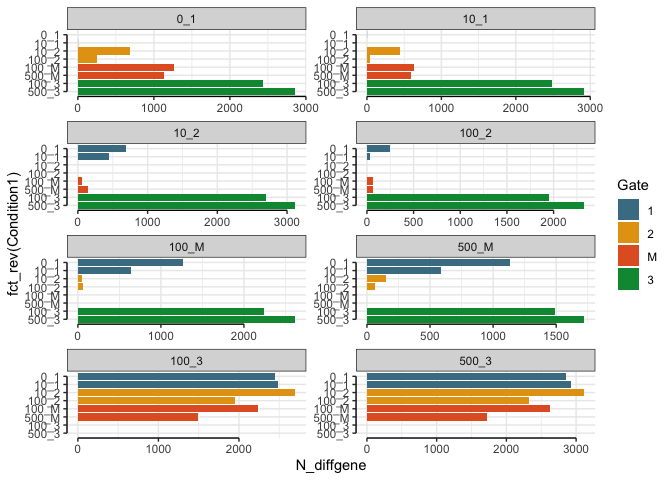
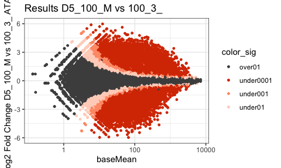
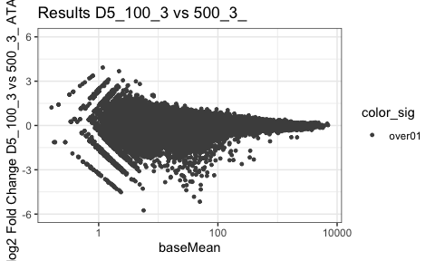
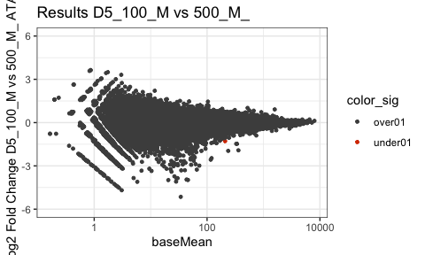
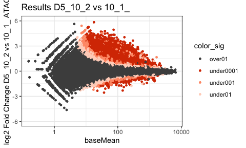
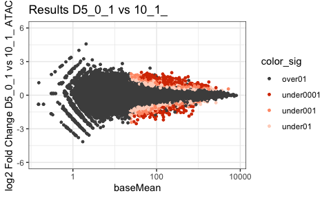
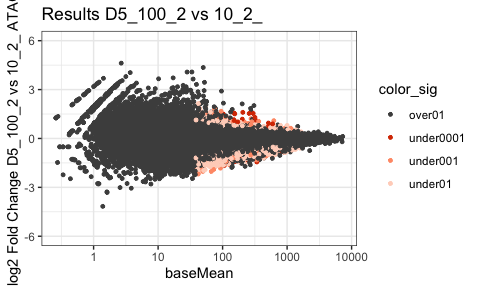
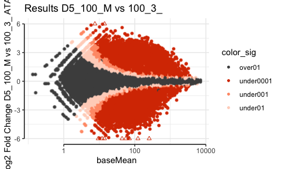

Accessibility comparisons across conditions
================

## Question:

How does the accessibility landscape compare between conditions? Do
sample of the same cell type generated from different SAG concentration
differ?

``` r
rm(list=ls())

library(DESeq2)
library(RColorBrewer)
library(ComplexHeatmap)
library(tidyverse)
library(ggrastr)
library(lemon)
```

## Load data

Counts table and annotation generated by nf-core/atacseq in:
`results/bwa/mergedLibrary/macs/broadPeak/consensus/` Further elements
filtered with `cats-atac_1_filter_fdr.Rmd`

``` r
#counts table
count.table <- read.table(file="/Users/delasj/Documents/BriscoeLab/project_DV_ATAC_reproduce_analysis/inputs_cats-atac_2_pca_heatmap/consensus_peaks.mLb.clN.featureCounts.txt",header=TRUE, stringsAsFactors = FALSE)

# fdr per sample and interval - if peak overalapped
fdr.table <- read.table(file="/Users/delasj/Documents/BriscoeLab/project_DV_ATAC_reproduce_analysis/outputs_cats-atac_1/consensus_peakfdr_filtered.csv", header=TRUE, stringsAsFactors = FALSE)

# clean colnames
colnames(count.table) <- gsub(".mLb.clN.bam","",colnames(count.table))

# we do not need coordinates
count.table <- count.table %>%
  select("Geneid", starts_with("D"))

#keep only the filtered intervals
count.table <- count.table %>%
  filter(Geneid %in% fdr.table$interval_id)
```

## Colors and shapes

``` r
sorted.DayGate <- c("D3_NMP","D4_1","D4_2","D4_M","D4_3",
                    "D5_1","D5_2","D5_M","D5_3",
                    "D6_1","D6_2","D6_M","D6_3")
colorJD <- c("#878787","#6da4ba","#f0be56","#ec936f","#5bb357",
             "#477d92","#e5a114","#e3602b","#009640",
             "#2e525e","#9f7113","#ab4117","#044a23")
color_4gates <- c("#477d92","#e5a114","#e3602b","#009640")

shapes4_manual = c(18,15,16,17) # these are block
shapes5_manual = c(25,21,22,23,24) # these are filled
shapes4_fill_manual = c(23,21,22,24)
```

## Differential analysis: Day5 all pairwise combinations

All pairwise combination for D5. Count the number of diff exp genes are
between SAG vs between Gates.

Export results so they can be imported to avoid running again. Skip to
next block if already exported

``` r
count.matrix <- count.table %>%
  column_to_rownames("Geneid")


## Get all possible conditions from colnames
genecolData_all <- data.frame(Sample_ID = colnames(count.matrix))
genecolData_all <- genecolData_all %>% 
    separate(Sample_ID,into=c("Day","SAG","Gate","Rep"), sep="_", remove=FALSE) %>%
        mutate(Condition=paste(Day,SAG,Gate, sep="_"),
               DaySAG=paste(Day,SAG,sep = "_"),
               DayGate=paste(Day,Gate,sep="_"),
               Experiment=paste(SAG,Rep,sep="_"),
               SAGGate=paste0("_",SAG,"_",Gate,"_"))


#subset posible conditions for Day 5
timepoint=c("D5")
allconditions=genecolData_all %>% filter(Day==timepoint) %>% pull(SAGGate) %>% unique()

# make pairwise combinations 
comparisons <- combn(allconditions, 2)


outdir="/Users/delasj/Documents/BriscoeLab/project_DV_ATAC_reproduce_analysis/outputs_cats-atac_3/Results_DESeq_D5_cross_condition/"

PairWiseDEseq <- lapply(c(1:ncol(comparisons)),function (x) {
      celltypes <- comparisons[,x]
      sub_counts <- count.matrix %>%
        select(starts_with(timepoint) & contains(celltypes))
      #print<-colnames(sub_counts)
      
      ## Make metadata file for DESeq
      genecolData_sub <- data.frame(Sample_ID = colnames(sub_counts))
      genecolData_sub <- genecolData_sub %>%
        separate(Sample_ID,into=c("Day","SAG","Gate","Rep"), sep="_", remove=FALSE) %>%
        mutate(Condition=paste(Day,SAG,Gate, sep="_"),
               DaySAG=paste(Day,SAG,sep = "_"),
               DayGate=paste(Day,Gate,sep="_"),
               Experiment=paste(SAG,Rep,sep="_"))
      genecolData_sub <- as.data.frame(unclass(genecolData_sub))

      dds_sub <- DESeqDataSetFromMatrix(countData = sub_counts,
                                    colData = genecolData_sub,
                                    design = ~ Condition)

      dds_sub <- DESeq(dds_sub)

      vsd_sub <- varianceStabilizingTransformation(dds_sub,blind = FALSE)

      # Export normalized tables for plotting elsewhere
      dds_sub_counts <- counts(dds_sub, normalized = TRUE)
      vsd_sub_data <- assay(vsd_sub)

      results_sub <- results(dds_sub)

      ## Export files

      write.table(dds_sub_counts,
      file = paste0(outdir,"CountsNormalized_",timepoint,celltypes[1],celltypes[2],".txt"),
          quote = FALSE, row.names = TRUE)
      write.csv(vsd_sub_data,
          paste0(outdir,"VSData_",timepoint,celltypes[1],celltypes[2],".csv"),
          quote = FALSE)
      write.table(results_sub,
          file = paste0(outdir,"Results_DESeq_",timepoint,celltypes[1],celltypes[2],".txt"),
          quote = FALSE, row.names = TRUE)

      results_return <- results_sub %>% as.data.frame() %>% rownames_to_column("Intervals")
      results_return$Comparison <- paste0("Samples_",timepoint,celltypes[1],celltypes[2])
      results_return
})
```

Import if the chunk above was previously run

``` r
PairWiseDEseq <- lapply(list.files(path=outdir,pattern="Results_DESeq*", full.names=TRUE),function(x) {
  data <- read.table(x,header=T,stringsAsFactors=F) %>% as.data.frame() %>% rownames_to_column("Intervals")
  data$Comparison <- gsub("/Users/delasj/Documents/BriscoeLab/project_DV_ATAC_reproduce_analysis/outputs_cats-atac_3/Results_DESeq_D5_cross_condition//Results_DESeq_","", x)
  data$Comparison <- gsub(".txt","",data$Comparison)
  #colnames(data) <- c("Genes",gsub("_dupRGENcounts","",x))
  data
})
```

filter(padj \< 0.01 & abs(log2FoldChange) \> 2 & baseMean \> 100) To
then count

``` r
Results_D5_crosscondition <- do.call(rbind,PairWiseDEseq)

top_intervals_d5 <- Results_D5_crosscondition %>%
  as.data.frame() %>%
  filter(padj < 0.01 & abs(log2FoldChange) > 2 & baseMean > 100)


# how many diff accessible elements?
top_intervals_d5_plot <- top_intervals_d5 %>%
  group_by(Comparison) %>%
  mutate(N_diffgene=n()) %>%
  select(Comparison, N_diffgene) %>%
  unique() %>%
  mutate(Comparison=gsub("D5_","", Comparison)) %>%
  separate(Comparison, into = c("Condition1","Condition2"), remove = FALSE, sep = "__") %>%
  mutate(Condition2=gsub("_$","",Condition2))

#to plot all by all comparisons
renamed_conditions <- top_intervals_d5_plot %>%
  dplyr::rename(ConditionA=Condition2) %>%
  dplyr::rename(Condition2=Condition1,
         Condition1=ConditionA)

Conditions.order=c("0_1","10_1","10_2","100_2","100_M","500_M","100_3","500_3")
doubleconditions_Table <- bind_rows(top_intervals_d5_plot,renamed_conditions) %>%
  mutate(Condition1=factor(Condition1, levels=Conditions.order),
         Condition2=factor(Condition2, levels=Conditions.order)) %>% 
  separate(Condition1, into = c("SAG","Gate"), remove = FALSE) %>%
  mutate(Gate=factor(Gate, levels = c("1","2","M","3")))


ggplot(doubleconditions_Table,aes(y=fct_rev(Condition1), x=N_diffgene, fill=Gate)) +
  scale_fill_manual(values = color_4gates) +
  geom_col(position=position_dodge()) +
  facet_rep_wrap(~ Condition2, scales = "free_x", ncol = 2, repeat.tick.labels = 'left') +
  coord_capped_cart(bottom='both', left='both') +
  theme_bw() + theme(panel.border=element_blank(), axis.line=element_line())
```

<!-- -->

Show some correlation or MA plots: 100 SAG p3 vs pMN 100 SAG pMN vs 500
SAG pMN 100 SAG p3 vs 500 SAG p3

10 SAG p1 vs p2 0 SAG p1 vs p2 0 SAG p1 vs 10 SAG p1 10 SAG p2 vs 100
SAG p2

``` r
comparison.wanted1 = c("D5_100_3__100_M_","D5_100_M__100_3_") 
comparison.wanted2 = c("D5_100_3__500_3_","D5_500_3__100_3_")
comparison.wanted3 = c("D5_100_M__500_M_","D5_500_M__100_M_")

comparison.wanted4 = c("D5_10_1__10_2_","D5_10_2__10_1_")
comparison.wanted5 = c("D5_10_1__0_1_","D5_0_1__10_1_")
comparison.wanted6 = c("D5_10_2__100_2_","D5_100_2__10_2_")


lapply(list(comparison.wanted1,comparison.wanted2,comparison.wanted3,
            comparison.wanted4,comparison.wanted5,comparison.wanted6), function(comparison.wanted){
              
      results_sub = Results_D5_crosscondition %>% filter(Comparison %in% comparison.wanted)
      
      #Get the info to automatically label plot
      comparison.plotted = results_sub$Comparison %>% unique()
      comparison.plotted = gsub("__"," vs ", comparison.plotted)
      
      # color significant
      results_sub_plot1 <- results_sub %>%
        mutate(color_sig=case_when(padj < 0.1 & padj > 0.01 ~ "under01",
                                   padj < 0.01 & padj > 0.001 ~ "under001",
                                   padj < 0.001 & padj >0 ~ "under0001",
                                   TRUE ~ "over01"))
      
      threshold <- 6
      table(results_sub_plot1$color_sig)
      
      n_diff_1 <- results_sub_plot1 %>%
        mutate(Sig0001 = case_when(padj < 0.001 & log2FoldChange > 0 ~ "up",
                                   padj < 0.001 & log2FoldChange < 0 ~ "down"))
      table(n_diff_1$Sig0001)
      
      ggplot(results_sub_plot1, aes(x=baseMean, y=log2FoldChange, color=color_sig)) +
          geom_point(size=1) +
          #geom_point(data= results_sub_plot1[results_sub_plot1$log2FoldChange > threshold,],
          #          aes(x=baseMean, y=threshold), shape = 2, colour="#d83a00") +
          #geom_point(data= results_sub_plot1[results_sub_plot1$log2FoldChange < -threshold,],
          #          aes(x=baseMean, y=-threshold), shape = 2, colour="#d83a00") +
          ylim(-threshold,threshold) +
          scale_x_log10() +
          scale_color_manual(values = c("gray30","#d83a00","#ff9b76","#ffd4c4")) +
          ylab(paste0("log2 Fold Change ", comparison.plotted ," ATAC")) +
          ggtitle(paste0("Results ",comparison.plotted)) +
          theme_bw() 
})
```

    ## [[1]]

    ## Warning: Removed 10 rows containing missing values (geom_point).

<!-- -->

    ## 
    ## [[2]]

    ## Warning: Transformation introduced infinite values in continuous x-axis

    ## Warning: Removed 2 rows containing missing values (geom_point).

<!-- -->

    ## 
    ## [[3]]

    ## Warning: Transformation introduced infinite values in continuous x-axis

    ## Warning: Removed 1 rows containing missing values (geom_point).

<!-- -->

    ## 
    ## [[4]]

    ## Warning: Transformation introduced infinite values in continuous x-axis

    ## Warning: Removed 3 rows containing missing values (geom_point).

<!-- -->

    ## 
    ## [[5]]

<!-- -->

    ## 
    ## [[6]]

<!-- -->

Code for printing in pdf rasterized

``` r
comparison.wanted1 = c("D5_100_3__100_M_","D5_100_M__100_3_") 
comparison.wanted2 = c("D5_100_3__500_3_","D5_500_3__100_3_")
comparison.wanted3 = c("D5_100_M__500_M_","D5_500_M__100_M_")

comparison.wanted = comparison.wanted1
results_sub = Results_D5_crosscondition %>% filter(Comparison %in% comparison.wanted)

#Get the info to automatically label plot
comparison.plotted = results_sub$Comparison %>% unique()
comparison.plotted = gsub("__"," vs ", comparison.plotted)

# color significant
results_sub_plot1 <- results_sub %>%
  mutate(color_sig=case_when(padj < 0.1 & padj > 0.01 ~ "under01",
                             padj < 0.01 & padj > 0.001 ~ "under001",
                             padj < 0.001 & padj >0 ~ "under0001",
                             TRUE ~ "over01"))

threshold <- 6
table(results_sub_plot1$color_sig)
```

    ## 
    ##    over01 under0001  under001   under01 
    ##     65216     24743      7706     13973

``` r
n_diff_1 <- results_sub_plot1 %>%
  mutate(Sig0001 = case_when(padj < 0.001 & log2FoldChange > 0 ~ "up",
                             padj < 0.001 & log2FoldChange < 0 ~ "down"))
table(n_diff_1$Sig0001)
```

    ## 
    ##  down    up 
    ## 10370 14373

``` r
ggplot(results_sub_plot1, aes(x=baseMean, y=log2FoldChange, color=color_sig)) +
    rasterise(geom_point(size=1), dpi = 150) +
    #geom_point(size=1) +
    geom_point(data= results_sub_plot1[results_sub_plot1$log2FoldChange > threshold,],
             aes(x=baseMean, y=threshold), shape = 2, colour="#d83a00") +
    geom_point(data= results_sub_plot1[results_sub_plot1$log2FoldChange < -threshold,],
             aes(x=baseMean, y=-threshold), shape = 2, colour="#d83a00") +
    ylim(-threshold,threshold) +
    scale_x_log10() +
    scale_color_manual(values = c("gray30","#d83a00","#ff9b76","#ffd4c4")) +
    ylab(paste0("log2 Fold Change ", comparison.plotted ," ATAC")) +
    ggtitle(paste0("Results ",comparison.plotted)) +
    coord_capped_cart(bottom='both', left='both') +
    theme_bw() + theme(panel.border=element_blank(), axis.line=element_line())
```

    ## Warning: Removed 10 rows containing missing values (geom_point).

<!-- -->

``` r
sessionInfo()
```

    ## R version 3.6.3 (2020-02-29)
    ## Platform: x86_64-apple-darwin15.6.0 (64-bit)
    ## Running under: macOS Catalina 10.15.7
    ## 
    ## Matrix products: default
    ## BLAS:   /Library/Frameworks/R.framework/Versions/3.6/Resources/lib/libRblas.0.dylib
    ## LAPACK: /Library/Frameworks/R.framework/Versions/3.6/Resources/lib/libRlapack.dylib
    ## 
    ## locale:
    ## [1] en_GB.UTF-8/en_GB.UTF-8/en_GB.UTF-8/C/en_GB.UTF-8/en_GB.UTF-8
    ## 
    ## attached base packages:
    ##  [1] grid      parallel  stats4    stats     graphics  grDevices utils    
    ##  [8] datasets  methods   base     
    ## 
    ## other attached packages:
    ##  [1] lemon_0.4.5                 ggrastr_1.0.1              
    ##  [3] forcats_0.5.1               stringr_1.4.0              
    ##  [5] dplyr_1.0.8                 purrr_0.3.4                
    ##  [7] readr_2.1.2                 tidyr_1.2.0                
    ##  [9] tibble_3.1.6                ggplot2_3.3.5              
    ## [11] tidyverse_1.3.1             ComplexHeatmap_2.2.0       
    ## [13] RColorBrewer_1.1-3          DESeq2_1.26.0              
    ## [15] SummarizedExperiment_1.16.1 DelayedArray_0.12.3        
    ## [17] BiocParallel_1.20.1         matrixStats_0.61.0         
    ## [19] Biobase_2.46.0              GenomicRanges_1.38.0       
    ## [21] GenomeInfoDb_1.22.1         IRanges_2.20.2             
    ## [23] S4Vectors_0.24.4            BiocGenerics_0.32.0        
    ## 
    ## loaded via a namespace (and not attached):
    ##   [1] ggbeeswarm_0.6.0       colorspace_2.0-3       rjson_0.2.20          
    ##   [4] ellipsis_0.3.2         circlize_0.4.14        htmlTable_2.4.0       
    ##   [7] XVector_0.26.0         fs_1.5.2               GlobalOptions_0.1.2   
    ##  [10] base64enc_0.1-3        clue_0.3-60            rstudioapi_0.13       
    ##  [13] farver_2.1.0           bit64_4.0.5            AnnotationDbi_1.48.0  
    ##  [16] fansi_1.0.3            lubridate_1.8.0        xml2_1.3.3            
    ##  [19] splines_3.6.3          cachem_1.0.6           geneplotter_1.64.0    
    ##  [22] knitr_1.38             Formula_1.2-4          jsonlite_1.8.0        
    ##  [25] Cairo_1.5-15           broom_0.7.12           annotate_1.64.0       
    ##  [28] cluster_2.1.2          dbplyr_2.1.1           png_0.1-7             
    ##  [31] compiler_3.6.3         httr_1.4.2             backports_1.4.1       
    ##  [34] assertthat_0.2.1       Matrix_1.3-2           fastmap_1.1.0         
    ##  [37] cli_3.2.0              htmltools_0.5.2        tools_3.6.3           
    ##  [40] gtable_0.3.0           glue_1.6.2             GenomeInfoDbData_1.2.2
    ##  [43] Rcpp_1.0.8.3           cellranger_1.1.0       vctrs_0.4.0           
    ##  [46] xfun_0.30              rvest_1.0.2            lifecycle_1.0.1       
    ##  [49] XML_3.99-0.3           zlibbioc_1.32.0        scales_1.1.1          
    ##  [52] hms_1.1.1              yaml_2.3.5             memoise_2.0.1         
    ##  [55] gridExtra_2.3          rpart_4.1.16           latticeExtra_0.6-29   
    ##  [58] stringi_1.7.6          RSQLite_2.2.12         highr_0.9             
    ##  [61] genefilter_1.68.0      checkmate_2.0.0        shape_1.4.6           
    ##  [64] rlang_1.0.2            pkgconfig_2.0.3        bitops_1.0-7          
    ##  [67] evaluate_0.15          lattice_0.20-45        labeling_0.4.2        
    ##  [70] htmlwidgets_1.5.4      bit_4.0.4              tidyselect_1.1.2      
    ##  [73] plyr_1.8.7             magrittr_2.0.3         R6_2.5.1              
    ##  [76] generics_0.1.2         Hmisc_4.6-0            DBI_1.1.2             
    ##  [79] withr_2.5.0            pillar_1.7.0           haven_2.4.3           
    ##  [82] foreign_0.8-76         survival_3.3-1         RCurl_1.98-1.6        
    ##  [85] nnet_7.3-17            modelr_0.1.8           crayon_1.5.1          
    ##  [88] utf8_1.2.2             tzdb_0.3.0             rmarkdown_2.13        
    ##  [91] jpeg_0.1-9             GetoptLong_1.0.5       locfit_1.5-9.4        
    ##  [94] readxl_1.4.0           data.table_1.14.2      blob_1.2.2            
    ##  [97] reprex_2.0.1           digest_0.6.29          xtable_1.8-4          
    ## [100] munsell_0.5.0          beeswarm_0.4.0         vipor_0.4.5
