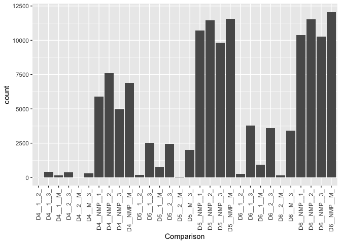
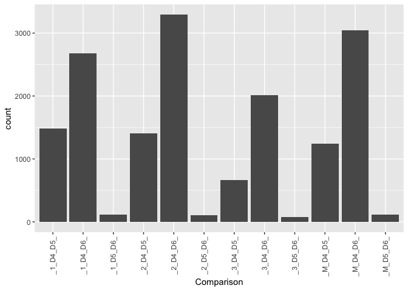

Differential accessibility across time and cell types
================

# Clustering by kmeans after filtering elements

The goal is to filter elements to use the differentially accessible ones
for clustering. We will also filter out low counts elements.

``` r
rm(list=ls())

library(DESeq2)
library(RColorBrewer)
library(tidyverse)
library(ComplexHeatmap)
```

### Set dirs

``` r
workingdir="/Users/delasj/Documents/BriscoeLab/project_DV_ATAC_reproduce_analysis/"
outdir="outputs_cats-atac_4/"
ifelse(!dir.exists(file.path(workingdir,outdir)), dir.create(file.path(workingdir,outdir)), "Directory exists")
```

    ## [1] "Directory exists"

``` r
outsubdir1="Domain_Specific/"
ifelse(!dir.exists(file.path(workingdir,outdir,outsubdir1)), dir.create(file.path(workingdir,outdir,outsubdir1)), "Directory exists")
```

    ## [1] "Directory exists"

``` r
outsubdir2="Timepoint_Specific/"
ifelse(!dir.exists(file.path(workingdir,outdir,outsubdir2)), dir.create(file.path(workingdir,outdir,outsubdir2)), "Directory exists")
```

    ## [1] "Directory exists"

## Load data

Counts table and annotation generated by nf-core/atacseq in:
`cats_atac/results/bwa/mergedLibrary/macs/broadPeak/consensus/` Further
elements filtered with `cats-atac_1_filter_fdr.Rmd`

``` r
#counts table
count_table <- read.table(file=paste0(workingdir,"inputs_cats-atac_2_pca_heatmap/consensus_peaks.mLb.clN.featureCounts.txt"),header=TRUE, stringsAsFactors = FALSE)

# fdr per sample and interval - if peak overalapped
fdr.table <- read.table(file=paste0(workingdir,"outputs_cats-atac_1/consensus_peakfdr_filtered.csv"), header=TRUE, stringsAsFactors = FALSE)

# clean colnames
colnames(count_table) <- gsub(".mLb.clN.bam","",colnames(count_table))

# we do not need coordinates
count_table <- count_table %>%
  select("Geneid", starts_with("D"))

#keep only the filtered intervals
count_table <- count_table %>%
  filter(Geneid %in% fdr.table$interval_id)
```

## Colors and shapes

``` r
sorted.DayGate <- c("D3_NMP","D4_1","D4_2","D4_M","D4_3",
                    "D5_1","D5_2","D5_M","D5_3",
                    "D6_1","D6_2","D6_M","D6_3")

sorted.samples <- c("D3_0_NMP","D4_0_1","D4_10_1","D5_0_1","D5_10_1","D6_0_1","D6_10_1",
                   "D4_10_2","D4_100_2","D5_10_2","D5_100_2","D6_10_2","D6_100_2",
                   "D4_100_M","D4_500_M","D5_100_M","D5_500_M","D6_100_M","D6_500_M",
                   "D4_100_3","D4_500_3","D5_100_3","D5_500_3","D6_100_3","D6_500_3")

colorJD <- c("#878787","#6da4ba","#f0be56","#ec936f","#5bb357",
             "#477d92","#e5a114","#e3602b","#009640",
             "#2e525e","#9f7113","#ab4117","#044a23")

shapes4_manual = c(18,15,16,17) # these are block
shapes5_manual = c(25,21,22,23,24) # these are filled
shapes4_fill_manual = c(23,21,22,24)

# Annotated heatmap with selected colors
hm_colors = colorRampPalette(rev(brewer.pal(n = 11, name = "RdBu")))(100)
```

## Run Deseq2

Only run once. It will take a while.

If already run, skip to Import Deseq2 results

### Differential accessibility between domains (include NMP)

D3 & D4: NMP, p0-1, p2, pM, p3 pairwise comparisons D3 & D5: p0-1, p2,
pM, p3 pairwise comparisons D3 & D6: p0-1, p2, pM, p3 pairwise
comparisons

``` r
#subset 
timepoint=matrix(c("D3_","D4_","D3_","D5_","D3_","D6_"),nrow = 2, ncol=3)
#matrix
comparisons=matrix(c("_NMP_","_1_","_NMP_","_2_","_NMP_","_M_","_NMP_","_3_","_1_","_2_","_1_","_M_","_1_","_3_",
                  "_2_","_M_","_2_","_3_","_M_","_3_"),
                 nrow=2,
                 ncol=10)


count_matrix <- count_table %>%
  column_to_rownames("Geneid")


PairWiseDEseq <- lapply(c(1:ncol(timepoint)),function (x) {
  lapply(c(1:ncol(comparisons)), function (y) {
      timepoints <- timepoint[,x]
      celltypes <- comparisons[,y]
      sub_counts <- count_matrix %>%
        dplyr::select(contains(celltypes) & contains(timepoints))
      
      ## Make metadata file for DESeq
      genecolData_sub <- data.frame(Sample_ID = colnames(sub_counts))
      genecolData_sub <- genecolData_sub %>% 
        separate(Sample_ID,into=c("Day","SAG","Gate","Rep"), sep="_", remove=FALSE) %>%
        mutate(Condition=paste(Day,SAG,Gate, sep="_"),
         DayGate=paste(Day,Gate,sep="_"),
         Experiment=paste(SAG,Rep,sep="_"))
      genecolData_sub <- as.data.frame(unclass(genecolData_sub))
      
      dds_sub <- DESeqDataSetFromMatrix(countData = sub_counts,
                                    colData = genecolData_sub,
                                    design = ~ Gate)
      
      dds_sub <- DESeq(dds_sub)
      
      vsd_sub <- varianceStabilizingTransformation(dds_sub,blind = FALSE)
      
      # Export normalized tables for plotting elsewhere
      dds_sub_counts <- counts(dds_sub, normalized = TRUE)
      vsd_sub_data <- assay(vsd_sub)
      
      results_sub <- results(dds_sub)

      # plotMA(results_sub,ylim=c(-8,8))

      ## Export files
      
      write.table(dds_sub_counts,
      file = paste0(workingdir,outdir,outsubdir1,"CountsNormalized_",timepoints[2],celltypes[1],celltypes[2],".txt"),
          quote = FALSE, row.names = TRUE)
      write.csv(vsd_sub_data,
          paste0(workingdir,outdir,outsubdir1,"VSData_",timepoints[2],celltypes[1],celltypes[2],".csv"),
          quote = FALSE)
      write.table(results_sub,
          file = paste0(workingdir,outdir,outsubdir1,"Results_DESeq_",timepoints[2],celltypes[1],celltypes[2],".txt"),
          quote = FALSE, row.names = TRUE)

      results_return <- results_sub %>% as.data.frame() %>% rownames_to_column("Geneid")
      results_return$Comparison <- paste0("Comp_",timepoints[2],celltypes[1],celltypes[2])
      results_return

  })
}) 
```

### Differential accessibility between timepoints

Then step 2: across time p0-1: D4, D5, D6 pairwise comparisons p2: D4,
D5, D6 pairwise comparisons pM: D4, D5, D6 pairwise comparisons p3: D4,
D5, D6 pairwise comparisons

``` r
#subset 
gates=c("_1_","_2_","_M_","_3_")
#matrix
timecomparisons=matrix(c("D4_","D5_","D4_","D6_","D5_","D6_"),
                 nrow=2,
                 ncol=3)


count_matrix <- count_table %>%
  column_to_rownames("Geneid")


PairWiseDEseq <- lapply(c(1:length(gates)),function (x) {
  lapply(c(1:ncol(timecomparisons)), function (y) {
      celltypes <- gates[x]
      timepoints <- timecomparisons[,y]
      sub_counts <- count_matrix %>%
        dplyr::select(contains(celltypes) & contains(timepoints))
      
      ## Make metadata file for DESeq
      genecolData_sub <- data.frame(Sample_ID = colnames(sub_counts))
      genecolData_sub <- genecolData_sub %>% 
        separate(Sample_ID,into=c("Day","SAG","Gate","Rep"), sep="_", remove=FALSE) %>%
        mutate(Condition=paste(Day,SAG,Gate, sep="_"),
         DayGate=paste(Day,Gate,sep="_"),
         Experiment=paste(SAG,Rep,sep="_"))
      genecolData_sub <- as.data.frame(unclass(genecolData_sub))
      
      dds_sub <- DESeqDataSetFromMatrix(countData = sub_counts,
                                    colData = genecolData_sub,
                                    design = ~ Day)
      
      dds_sub <- DESeq(dds_sub)
      
      vsd_sub <- varianceStabilizingTransformation(dds_sub,blind = FALSE)
      
      # Export normalized tables for plotting elsewhere
      dds_sub_counts <- counts(dds_sub, normalized = TRUE)
      vsd_sub_data <- assay(vsd_sub)
      
      results_sub <- results(dds_sub)

      # plotMA(results_sub,ylim=c(-8,8))

      ## Export files
      
      write.table(dds_sub_counts,
      file = paste0(workingdir,outdir,outsubdir2,"CountsNormalized_",celltypes[1],timepoints[1],timepoints[2],".txt"),
          quote = FALSE, row.names = TRUE)
      write.csv(vsd_sub_data,
          paste0(workingdir,outdir,outsubdir2,"VSData_",celltypes[1],timepoints[1],timepoints[2],".csv"),
          quote = FALSE)
      write.table(results_sub,
          file = paste0(workingdir,outdir,outsubdir2,"Results_DESeq_",celltypes[1],timepoints[1],timepoints[2],".txt"),
          quote = FALSE, row.names = TRUE)

      results_return <- results_sub %>% as.data.frame() %>% rownames_to_column("Geneid")
      results_return$Comparison <- paste0("Comp_",celltypes[1],timepoints[1],timepoints[2])
      results_return

  })
}) 
```

## Import Deseq2 results

``` r
PairWiseDEseq_domain <- lapply(list.files(path=paste0(workingdir,outdir,outsubdir1),pattern="Results_DESeq*", full.names=TRUE),function(x) {
  data <- read.table(x,header=T,stringsAsFactors=F) %>% as.data.frame() %>% rownames_to_column("Intervals")
  data$Comparison <- gsub(paste0(workingdir,outdir,outsubdir1,"/Results_DESeq_"),"", x)
  data$Comparison <- gsub(".txt","",data$Comparison)
  data
})

results_deseq_domain <- do.call(rbind,PairWiseDEseq_domain)
```

``` r
PairWiseDEseq_days <- lapply(list.files(path=paste0(workingdir,outdir,outsubdir2),pattern="Results_DESeq*", full.names=TRUE),function(x) {
  data <- read.table(x,header=T,stringsAsFactors=F) %>% as.data.frame() %>% rownames_to_column("Intervals")
  data$Comparison <- gsub(paste0(workingdir,outdir,outsubdir2,"/Results_DESeq_"),"", x)
  data$Comparison <- gsub(".txt","",data$Comparison)
  data
})

results_deseq_days <- do.call(rbind,PairWiseDEseq_days)
```

## Filter differentially accessible

``` r
top_domain_comparisons <- results_deseq_domain %>%
  as.data.frame() %>%
  filter(padj < 0.01 & abs(log2FoldChange) > 2 & baseMean > 100)


ggplot(top_domain_comparisons, aes(x=Comparison)) +
  geom_bar() +
  theme(axis.text.x = element_text(angle = 90, vjust = 0.5, hjust=1))
```

<!-- -->

``` r
top_days_comparisons <- results_deseq_days %>%
  as.data.frame() %>%
  filter(padj < 0.01 & abs(log2FoldChange) > 2 & baseMean > 100)


ggplot(top_days_comparisons, aes(x=Comparison)) +
  geom_bar() +
  theme(axis.text.x = element_text(angle = 90, vjust = 0.5, hjust=1))
```

<!-- -->

## Subset elements

``` r
diffexpr_time_gate <- c(top_domain_comparisons$Intervals,top_days_comparisons$Intervals) %>% unique()

write.csv(diffexpr_time_gate, file=paste0(workingdir,outdir,"DiffAccessible_elements.csv"), quote = FALSE, row.names = FALSE)
```

``` r
sessionInfo()
```

    ## R version 3.6.3 (2020-02-29)
    ## Platform: x86_64-apple-darwin15.6.0 (64-bit)
    ## Running under: macOS Catalina 10.15.7
    ## 
    ## Matrix products: default
    ## BLAS:   /Library/Frameworks/R.framework/Versions/3.6/Resources/lib/libRblas.0.dylib
    ## LAPACK: /Library/Frameworks/R.framework/Versions/3.6/Resources/lib/libRlapack.dylib
    ## 
    ## locale:
    ## [1] en_GB.UTF-8/en_GB.UTF-8/en_GB.UTF-8/C/en_GB.UTF-8/en_GB.UTF-8
    ## 
    ## attached base packages:
    ##  [1] grid      parallel  stats4    stats     graphics  grDevices utils    
    ##  [8] datasets  methods   base     
    ## 
    ## other attached packages:
    ##  [1] ComplexHeatmap_2.2.0        forcats_0.5.1              
    ##  [3] stringr_1.4.0               dplyr_1.0.8                
    ##  [5] purrr_0.3.4                 readr_2.1.2                
    ##  [7] tidyr_1.2.0                 tibble_3.1.6               
    ##  [9] ggplot2_3.3.5               tidyverse_1.3.1            
    ## [11] RColorBrewer_1.1-3          DESeq2_1.26.0              
    ## [13] SummarizedExperiment_1.16.1 DelayedArray_0.12.3        
    ## [15] BiocParallel_1.20.1         matrixStats_0.61.0         
    ## [17] Biobase_2.46.0              GenomicRanges_1.38.0       
    ## [19] GenomeInfoDb_1.22.1         IRanges_2.20.2             
    ## [21] S4Vectors_0.24.4            BiocGenerics_0.32.0        
    ## 
    ## loaded via a namespace (and not attached):
    ##  [1] colorspace_2.0-3       rjson_0.2.20           ellipsis_0.3.2        
    ##  [4] circlize_0.4.14        htmlTable_2.4.0        XVector_0.26.0        
    ##  [7] GlobalOptions_0.1.2    base64enc_0.1-3        fs_1.5.2              
    ## [10] clue_0.3-60            rstudioapi_0.13        farver_2.1.0          
    ## [13] bit64_4.0.5            AnnotationDbi_1.48.0   fansi_1.0.3           
    ## [16] lubridate_1.8.0        xml2_1.3.3             splines_3.6.3         
    ## [19] cachem_1.0.6           geneplotter_1.64.0     knitr_1.38            
    ## [22] Formula_1.2-4          jsonlite_1.8.0         broom_0.7.12          
    ## [25] annotate_1.64.0        cluster_2.1.2          dbplyr_2.1.1          
    ## [28] png_0.1-7              compiler_3.6.3         httr_1.4.2            
    ## [31] backports_1.4.1        assertthat_0.2.1       Matrix_1.3-2          
    ## [34] fastmap_1.1.0          cli_3.2.0              htmltools_0.5.2       
    ## [37] tools_3.6.3            gtable_0.3.0           glue_1.6.2            
    ## [40] GenomeInfoDbData_1.2.2 Rcpp_1.0.8.3           cellranger_1.1.0      
    ## [43] vctrs_0.4.0            xfun_0.30              rvest_1.0.2           
    ## [46] lifecycle_1.0.1        XML_3.99-0.3           zlibbioc_1.32.0       
    ## [49] scales_1.1.1           hms_1.1.1              yaml_2.3.5            
    ## [52] memoise_2.0.1          gridExtra_2.3          rpart_4.1.16          
    ## [55] latticeExtra_0.6-29    stringi_1.7.6          RSQLite_2.2.12        
    ## [58] highr_0.9              genefilter_1.68.0      checkmate_2.0.0       
    ## [61] shape_1.4.6            rlang_1.0.2            pkgconfig_2.0.3       
    ## [64] bitops_1.0-7           evaluate_0.15          lattice_0.20-45       
    ## [67] labeling_0.4.2         htmlwidgets_1.5.4      bit_4.0.4             
    ## [70] tidyselect_1.1.2       magrittr_2.0.3         R6_2.5.1              
    ## [73] generics_0.1.2         Hmisc_4.6-0            DBI_1.1.2             
    ## [76] pillar_1.7.0           haven_2.4.3            foreign_0.8-76        
    ## [79] withr_2.5.0            survival_3.3-1         RCurl_1.98-1.6        
    ## [82] nnet_7.3-17            modelr_0.1.8           crayon_1.5.1          
    ## [85] utf8_1.2.2             tzdb_0.3.0             rmarkdown_2.13        
    ## [88] jpeg_0.1-9             GetoptLong_1.0.5       locfit_1.5-9.4        
    ## [91] readxl_1.4.0           data.table_1.14.2      blob_1.2.2            
    ## [94] reprex_2.0.1           digest_0.6.29          xtable_1.8-4          
    ## [97] munsell_0.5.0
