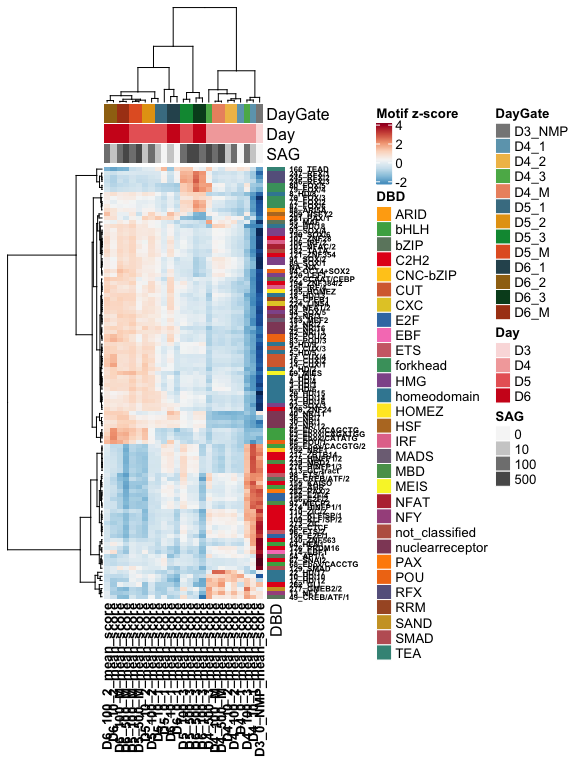
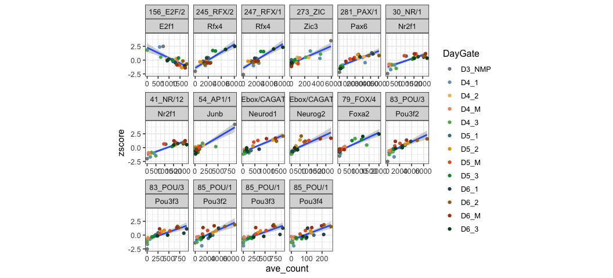
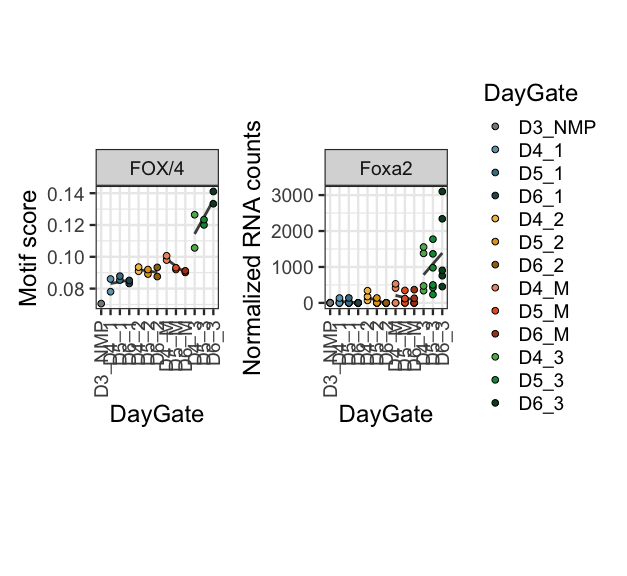

Footprinting across all 25 conditions
================

``` r
rm(list=ls())

library(RColorBrewer)
library(tidyverse)
library(genomation)
library(matrixStats)
library(ComplexHeatmap)
library(readxl)
library(broom)
library(patchwork)
```

## Finding candidates TFs that explain differences between samples

### Set dirs

``` r
workingdir="/Users/delasj/Documents/BriscoeLab/project_DV_ATAC_reproduce_analysis/"
subworkinput="inputs_footprinting/"
subworkdir="outputs_footprinting_allconditions/"
ifelse(!dir.exists(file.path(workingdir,subworkdir)), dir.create(file.path(workingdir,subworkdir)), "Directory exists")
```

    ## [1] "Directory exists"

### Input data

Ouput of bindetect is in
`BINDetect_25conditions_arch/bindetect_results.txt`

Motif annotation excel file was downloaded from Vierstra’s [motif
clustering](https://www.vierstra.org/resources/motif_clustering#downloads)

Archetype to possible genes lookup table
`lookup_motif_gene_archetype_21-11-23.csv` is custom made.

``` r
Motif_preds_tabl <- read.table(paste0(workingdir,subworkinput,"bindetect_results.txt"),header=T,sep="\t",stringsAsFactors=F)
```

Clean up table and keep relevant samples.

``` r
Motif_scores <- Motif_preds_tabl %>%
  select(c("output_prefix" ,"name","motif_id","cluster", "motif_logo","total_tfbs",contains("_score"))) %>%
  select(-contains("_3_mean_score")) %>%
  select(-contains("NMP_mean_score"))
```

### table to group motifs to archetypes

``` r
archetypes_clusterid <- read_excel(paste0(workingdir,subworkinput,"motif_annotations.xlsx"),2)  
archtypes_names <- read_excel(paste0(workingdir,subworkinput,"motif_annotations.xlsx"),1)  

archtypes_2_motifs <- archetypes_clusterid %>% select(c("Cluster_ID","Motif","Database","Consensus")) %>%
  left_join(archtypes_names %>% select(c("Cluster_ID","Name","DBD","Seed_motif")), by="Cluster_ID")
archtypes_2_motifs$Cluster_ID <- as.character(archtypes_2_motifs$Cluster_ID)
```

### Archetype to possible TFs

``` r
gene_motifs_cluster <- read.csv(paste0(workingdir,subworkinput,"lookup_motif_gene_archetype_21-11-23.csv"), stringsAsFactors =FALSE,
                                colClasses=c("character","character"))
```

### Gene expression

``` r
gene_exp <- read.csv(paste0(workingdir,"/outputs_rna_1/RNA_normCounts_filter1.csv"), stringsAsFactors =FALSE)
```

## My colors and other settings

``` r
# Annotated heatmap with selected colors
hm_colors = colorRampPalette(rev(brewer.pal(n = 11, name = "RdBu")))(100)

# sample order etc
sorted.DayGate <- c("D3_NMP","D4_1","D4_2","D4_M","D4_3",
                    "D5_1","D5_2","D5_M","D5_3",
                    "D6_1","D6_2","D6_M","D6_3")

sorted.samples <- c("D3_0_NMP","D4_0_1","D4_10_1","D5_0_1","D5_10_1","D6_0_1","D6_10_1",
                   "D4_10_2","D4_100_2","D5_10_2","D5_100_2","D6_10_2","D6_100_2",
                   "D4_100_M","D4_500_M","D5_100_M","D5_500_M","D6_100_M","D6_500_M",
                   "D4_100_3","D4_500_3","D5_100_3","D5_500_3","D6_100_3","D6_500_3")

colorJD <- c("#878787","#6da4ba","#f0be56","#ec936f","#5bb357",
             "#477d92","#e5a114","#e3602b","#009640",
             "#2e525e","#9f7113","#ab4117","#044a23")
```

## Score subseting

### Filter most variable as the BINDetect volcano plot does

The volcano plots shows y\_min = np.percentile(yvalues\[yvalues \> 0\],
5) \#5% smallest pvalues x\_min, x\_max = np.percentile(xvalues, \[5,
95\]) \#5% smallest and largest changes

Filter lowest pval and largest changes *per* comparison

``` r
scores_plotTop <- Motif_preds_tabl %>% 
  select(c("output_prefix",ends_with("_score"))) %>%
  gather(quant_item, value,ends_with("_score"))

scores_plot_topchanges <- Motif_preds_tabl %>%
  select("output_prefix", ends_with("_change")) %>%
  gather(item_changes, value_change, ends_with("_change")) %>% 
  group_by(item_changes) %>%
  mutate(value_abs_change = abs(value_change)) %>%
  top_frac(0.05,value_abs_change) %>%
  ungroup() %>%
  spread(item_changes, value_change)


scores_plot_topovalues <- Motif_preds_tabl %>%
  select("output_prefix", ends_with("_pvalue")) %>%
  gather(item_pvalue, value_pvalue, ends_with("_pvalue")) %>% 
  group_by(item_pvalue) %>%
  top_frac(-0.05,value_pvalue) %>%
  ungroup() %>%
  spread(item_pvalue, value_pvalue)
```

### Subset motifs, group by archetype

First calculate and export to have a record of the most variable motif

``` r
scores_plot <- Motif_preds_tabl %>% select(c("output_prefix","name","motif_id","cluster", ends_with("_score")))
scores_subset <- scores_plot %>% 
  filter(output_prefix %in% as.character(scores_plot_topovalues$output_prefix) | output_prefix %in% as.character(scores_plot_topchanges$output_prefix)) 

scores_subset_cluster_motifname = scores_subset %>%
  left_join(archtypes_2_motifs, by = c("motif_id"="Motif")) %>%
  mutate(Archetype=paste(Cluster_ID,Name,sep = "_")) %>%
  gather(sample, mean_score, ends_with("_score")) %>%
  group_by(output_prefix) %>%
  mutate(score_var = var(mean_score)) %>%
  ungroup() %>% group_by(Archetype) %>%
  top_n(1,score_var) %>%
  spread(sample,mean_score)

write.table(scores_subset_cluster_motifname, file=paste0(workingdir,subworkdir,"Footprint_scores_variable_archetypes_allconditions.txt"), quote = FALSE, row.names = TRUE)
```

## Heatmap of top motif in cluster

Plot only one motif per archetype

``` r
scores_subset_cluster = scores_subset %>%
  left_join(archtypes_2_motifs, by = c("motif_id"="Motif")) %>%
  mutate(Archetype=paste(Cluster_ID,Name,sep = "_")) %>%
  gather(sample, mean_score, ends_with("_score")) %>%
  group_by(output_prefix) %>%
  mutate(score_var = var(mean_score)) %>%
  ungroup() %>% group_by(Archetype) %>%
  top_n(1,score_var) %>%
  select(-score_var, -output_prefix, -name, -motif_id, -cluster, -Database) %>% # eliminate the name of the motif
  unique() %>%
  spread(sample,mean_score)
  

top_motif_per_achr = scores_subset %>%
  left_join(archtypes_2_motifs, by = c("motif_id"="Motif")) %>%
  mutate(Archetype=paste(Cluster_ID,Name,sep = "_")) %>%
  gather(sample, mean_score, ends_with("_score")) %>%
  group_by(output_prefix) %>%
  mutate(score_var = var(mean_score)) %>%
  ungroup() %>% group_by(Archetype) %>%
  top_n(1,score_var) %>%
  select(-score_var, -name, -motif_id, -cluster, -Database) %>% # leave the motif name that was highest var
  unique() %>%
  spread(sample,mean_score)
```

### Heatmap of top motif per archetype

Annotated heatmap

``` r
scores_1percluster_ann <- scores_subset_cluster %>%
  select(c("Archetype","DBD","Name","Cluster_ID", ends_with("_score"))) %>%
  remove_rownames() %>%
  column_to_rownames("Archetype") %>%
  select("DBD")

scores_subset_hm <- scores_subset_cluster %>%
  remove_rownames() %>%
  column_to_rownames("Archetype") %>% select(ends_with("_score")) 

scores_subset_hm_z <- t(scale(t(scores_subset_hm))) 


## make column annotation
## Make metadata file, same as  DESeq but for heatmaps
genecolData_first <- data.frame(Sample_ID = colnames(scores_subset_cluster)) %>%
  filter(grepl("_score", Sample_ID)) %>%
  mutate(Sample_ID=gsub("_mean_score","",Sample_ID))
genecolData_first <- genecolData_first %>% 
  separate(Sample_ID,into=c("Day","SAG","Gate"), sep="_", remove=FALSE) %>%
  mutate(Condition=paste(Day,SAG,Gate, sep="_"),
         DaySAG=paste(Day,SAG,sep = "_"),
         DayGate=paste(Day,Gate,sep="_"))
genecolData_first <- as.data.frame(unclass(genecolData_first))

phen_data <- genecolData_first %>%
  select(c("Sample_ID","DayGate","Day","SAG")) %>%
  remove_rownames() %>%
  column_to_rownames("Sample_ID")

ann_color_JD <- list(
  DayGate = c(D3_NMP="#878787",D4_1="#6da4ba",D5_1="#477d92", D6_1="#2e525e",
              D4_2="#f0be56",D5_2="#e5a114",D6_2="#9f7113",
              D4_M="#ec936f",D5_M="#e3602b",D6_M="#ab4117",
              D4_3="#5bb357",D5_3="#009640",D6_3="#044a23"),
  SAG = c(`0`="#f6f6f6",`10`="#cecece",`100`="#808080",`500`="#595959"),
  Day = c(D3="#fadede",D4="#f3aaaa",D5="#e96666",D6="#cf1e1e"),
  Rep = c(R1="#ebeb77", R2="#77b1eb", R3="#eb7777"))


# Build the annotation for the complex heatmap
heatmap_ann <- HeatmapAnnotation(df=phen_data, col=ann_color_JD)

dbdlist <- scores_1percluster_ann %>% filter(DBD !="<NA>") %>% pull(DBD) %>% unique()
DBDcolors <- colorRampPalette(brewer.pal(8, "Set1"))(length(dbdlist))

names(DBDcolors) <- dbdlist 

#row ann with colors 
rowAnn <- HeatmapAnnotation(
    df = scores_1percluster_ann,
    which = 'row', # 'col' (samples) or 'row' (gene) annotation?
    na_col = 'white', # default colour for any NA values in the annotation data-frame, 'ann'
    col = list(DBD=c(DBDcolors)),
    annotation_height = 0.6,
    annotation_width = unit(1, 'cm'),
    gap = unit(1, 'mm'))

Heatmap(scores_subset_hm_z, name="Motif z-score",
                col = hm_colors,
                top_annotation = heatmap_ann,
                right_annotation = rowAnn,
        
                # row (gene) parameters
                cluster_rows = TRUE,
                show_row_dend = TRUE,
                #row_title = 'Statistically significant genes',
                row_title_side = 'left',
                row_title_gp = gpar(fontsize = 12,  fontface = 'bold'),
                row_title_rot = 90,
                show_row_names = TRUE,
                row_names_gp = gpar(fontsize = 6, fontface = 'bold'),
                row_names_side = 'right',
                row_dend_width = unit(25,'mm'),
                
                # column (sample) parameters
                cluster_columns = TRUE,
                show_column_dend = TRUE,
                column_title = '',
                column_title_side = 'bottom',
                column_title_gp = gpar(fontsize = 12, fontface = 'bold'),
                column_title_rot = 0,
                show_column_names = TRUE,
                column_names_gp = gpar(fontsize = 10, fontface = 'bold'),
                column_names_max_height = unit(10, 'cm'),
                column_dend_height = unit(25,'mm'),
                
                # cluster methods for rows and columns
                clustering_distance_columns = function(x) as.dist(1 - cor(t(x))),
                clustering_method_columns = 'ward.D2',
                clustering_distance_rows = function(x) as.dist(1 - cor(t(x))),
                clustering_method_rows = 'ward.D2'
        )
```

<!-- -->

## calculate z-scores

``` r
scores_subset_plot_z <- scores_subset_hm_z %>%
  as.data.frame() %>%
  rownames_to_column("Archetype")
  
scores_subset_plot_z_gather <- scores_subset_plot_z %>%
  gather("sample","zscore", ends_with("_score")) %>%
  mutate(sample=gsub("_mean_score","", sample),
         sample=factor(sample, levels = sorted.samples)) %>%
  separate(sample,into=c("Day","SAG","Gate"), sep="_", remove=FALSE) %>%
  mutate(Condition=paste(Day,SAG,Gate, sep="_"),
         DaySAG=paste(Day,SAG,sep = "_"),
         DayGate=paste(Day,Gate,sep="_")) %>%
  mutate(DayGate = factor(DayGate, levels = sorted.DayGate))
```

# Correlation with gene expression

Upload the lookup table and the gene expression matrix

``` r
gene_2_clusterID_all <- gene_motifs_cluster %>% select("Cluster_ID","mouse_genename") %>% unique()
gene_2_clusterID <- gene_2_clusterID_all %>% 
  filter(!is.na(mouse_genename))

gene_2_arch <- gene_2_clusterID %>%
  left_join(archtypes_2_motifs, by = "Cluster_ID") %>%
  mutate(Archetype=paste(Cluster_ID,Name,sep = "_"))
```

Clean tables

``` r
gene_exp_preclean <- gene_exp %>%
  dplyr::rename(genename=X) %>%
  gather(sample, norm_counts, starts_with("D")) %>%
  mutate(sample=gsub("\\.","_", sample)) %>%
  separate(sample,into=c("Day","SAG","Gate","Rep"), sep="_") %>%
  mutate(Condition=paste(Day,SAG,Gate, sep="_")) %>%
  group_by(Condition, genename) %>%
  summarise(ave_count = mean(norm_counts))
```

    ## `summarise()` has grouped output by 'Condition'. You can override using the
    ## `.groups` argument.

``` r
# Only keep genes where at least 1 Condition has more than 100 normalized counts (average across reps)
gene_exp_clean <- gene_exp %>%
  dplyr::rename(genename=X) %>%
  gather(sample, norm_counts, starts_with("D")) %>%
  mutate(sample=gsub("\\.","_", sample)) %>%
  separate(sample,into=c("Day","SAG","Gate","Rep"), sep="_") %>%
  mutate(Condition=paste(Day,SAG,Gate, sep="_")) %>%
  group_by(Condition, genename) %>%
  summarise(ave_count = mean(norm_counts), .groups="keep") %>%
  spread(Condition, ave_count) %>%
  filter(if_any(where(is.numeric), ~ .x > 100)) %>%
  gather(Condition, ave_count, starts_with("D"))


zscores_arch_clean <- scores_subset_plot_z_gather %>% 
  separate(Archetype, into = c("Cluster_ID","Cluster_name"), sep = "_", remove = FALSE) 

# archtypes that still have genes
gene_2_arch_expressionfiltered = gene_2_arch %>%
  filter(mouse_genename %in% gene_exp_clean$genename)
```

Write a function to plot all motif scores per archetype over samples

``` r
outdir="Plots_Archetypes_RNA/"

ifelse(!dir.exists(file.path(workingdir,subworkdir, outdir)), dir.create(file.path(workingdir,subworkdir, outdir)), FALSE)
```

    ## [1] FALSE

``` r
plot_scores_RNA <- function(x){
  
  clean_x = gsub("/","-",x)
  
  sub_zscores = zscores_arch_clean %>%
  filter(Archetype==x)
  
  sub_genes = gene_2_arch %>% filter(Archetype==x)
  
  sub_exp = gene_exp_clean %>% filter(genename %in% as.character(sub_genes$mouse_genename))
  
  sub_plot = sub_zscores %>%
    left_join(sub_exp, by = c("sample"="Condition")) 
  
  plot_gg <- ggplot(sub_plot, aes(x=ave_count, y=zscore)) +
  geom_smooth(method=lm, formula = y ~ x) +
  geom_point(aes(color=DayGate)) +
  scale_color_manual(values = colorJD) +
  facet_wrap( ~ genename, scales = "free_x") +
  theme_bw(base_size = 6) +
  theme(aspect.ratio = 1)
  ggsave(paste0(workingdir,subworkdir,outdir,"Arch_zscores_RNA_",clean_x,".pdf"), plot=plot_gg,
        width=7, height=5, units="in", useDingbats=FALSE)
  
  sub_corr <- sub_plot %>%
    group_by(genename) %>%
    mutate(arch2gene_corr = cor(zscore,ave_count)) %>%
    select(Archetype,Cluster_ID,Cluster_name,genename,arch2gene_corr) %>%
    unique()
  
  sub_fit <- sub_plot %>%
    group_by(genename) %>%
    do(fitgene =  glance(lm(zscore ~ ave_count, data = .))) %>%
    unnest(fitgene) %>%
    mutate(Archetype=x)
  
  sub_fit_corr <- sub_fit %>%
    inner_join(sub_corr, by=c("genename","Archetype"))

  write.csv(sub_fit_corr, file=paste0(workingdir,subworkdir,outdir,"Table_fit_cor_",clean_x,".csv"),
                row.names = F, quote = F)
} 
```

List of archetypes: from individual motifs -\> significant -\> most
variable motif per archetype representing

To save a long list of correlations

``` r
get_reg_fit_arch_RNA <- function(x){
  
  clean_x = gsub("/","-",x)
  
  sub_zscores = zscores_arch_clean %>%
  filter(Archetype==x)
  
  sub_genes = gene_2_arch %>% filter(Archetype==x)
  
  sub_exp = gene_exp_clean %>% filter(genename %in% as.character(sub_genes$mouse_genename))
  
  sub_plot = sub_zscores %>%
    left_join(sub_exp, by = c("sample"="Condition")) 

  sub_corr <- sub_plot %>%
    group_by(genename) %>%
    mutate(arch2gene_corr = cor(zscore,ave_count)) %>%
    select(Archetype,Cluster_ID,Cluster_name,genename,arch2gene_corr) %>%
    unique()
  
  sub_fit <- sub_plot %>%
    group_by(genename) %>%
    do(fitgene =  glance(lm(zscore ~ ave_count, data = .))) %>%
    unnest(fitgene) %>%
    mutate(Archetype=x)
  
  sub_fit_corr <- sub_fit %>%
    inner_join(sub_corr, by=c("genename","Archetype"))

  sub_fit_corr
} 

Arch_gene_fit_all <- lapply(top_arch, get_reg_fit_arch_RNA)

Arch_gene_fit_table <- do.call(rbind,Arch_gene_fit_all)
```

## Plot all motifs for each archetype

Explore the variable motifs, grouped by archetype, across all samples.

``` r
## Annotation to color by archetype
scores_cluster_arch_plot <- scores_subset %>%
  left_join(archtypes_2_motifs, by = c("motif_id"="Motif")) %>%
  mutate(Archetype=paste(Cluster_ID,Name,sep = "_")) %>%
  select(output_prefix,Archetype, ends_with("_score"))

scores_cluster_arch_plot_gather <- scores_cluster_arch_plot %>%
  gather("sample","score", ends_with("_score")) %>%
  mutate(sample=gsub("_mean_score","",sample),
         sample=factor(sample, levels = sorted.samples)) %>%
  separate(sample,into=c("Day","SAG","Gate"), sep="_", remove=FALSE) %>%
  mutate(Condition=paste(Day,SAG,Gate, sep="_"),
         DaySAG=paste(Day,SAG,sep = "_"),
         DayGate=paste(Day,Gate,sep="_")) %>%
  mutate(DayGate = factor(DayGate, levels = sorted.DayGate))
```

Function and print plot

``` r
outdir="Plots_scores_Arch/"

ifelse(!dir.exists(file.path(workingdir,subworkdir, outdir)), dir.create(file.path(workingdir,subworkdir, outdir)), FALSE)
```

    ## [1] FALSE

``` r
plot_scores_per_Arch <- function(x){
  
  clean_x = gsub("/","-",x)
  
  # Subset one archetype, all sig motifs
  scores_sub_1arch <- scores_cluster_arch_plot_gather %>% filter(Archetype %in% x)
  
  # Classic palette BuPu, with 4 colors
  coul <- rev(brewer.pal(4, "Greys"))

  # Add as many colors to this palette as motifs to plot
  coul <- colorRampPalette(coul)(length(scores_sub_1arch$output_prefix %>% unique()))

  plot_gg <- ggplot(scores_sub_1arch, aes(x=sample, y=score, group=output_prefix)) +
    geom_line(aes(color=output_prefix)) +
    geom_point(aes(fill=factor(DayGate)), size=2, shape=21, stroke=0) +
    #geom_point(aes(color=DayGate)) +
    scale_fill_manual(values = colorJD) +
    scale_color_manual(values = coul) +
    facet_wrap(~ Archetype) +
    theme_bw(base_size = 6) +
    theme(aspect.ratio = 1) +
    theme(axis.text.x = element_text(angle = 90, vjust = 0.5, hjust=1))
  
    ggsave(paste0(workingdir,subworkdir,outdir,"Motif_scores_perArch_",clean_x,".pdf"), plot=plot_gg,
        width=7, height=5, units="in", useDingbats=FALSE)
}
```

Run

### Plot the top Correlated

Get the top archetypes-gene from Arch\_gene\_fit\_table

Go back to function-all-cor-fits and get the full table

``` r
#this is an arbitrary filter to find the reasonably correlated ones and inspect
Top_fit <- Arch_gene_fit_table %>%
  filter(adj.r.squared > 0.6)


top_sub_zscores = zscores_arch_clean %>%
  filter(Archetype %in% Top_fit$Archetype)
  
top_sub_genes = gene_2_arch %>% filter(Archetype%in% Top_fit$Archetype & mouse_genename %in% Top_fit$genename) %>%
  select(-Motif,-Database,-Consensus) %>% unique()

top_sub_exp = top_sub_genes %>%
  left_join(gene_exp_clean, by = c("mouse_genename"="genename"))

top_sub_plot = top_sub_zscores %>%
  left_join(top_sub_exp, by = c("Archetype","Condition"))


ggplot(top_sub_plot, aes(x=ave_count, y=zscore, group=mouse_genename)) +
  geom_smooth(method=lm, formula = y ~ x) +
  geom_point(aes(color=DayGate)) +
  scale_color_manual(values = colorJD) +
  facet_wrap(Archetype ~ mouse_genename, scales = "free_x", ncol = 6) +
  theme_bw(base_size = 12) +
  theme(aspect.ratio = 1)
```

<!-- -->

As much as I love this score vs RNA plots, others don’t so much.

## Plot the RNA and the motif scores side by side for fig

The lines are just to help visualize the days together

``` r
#ordered by gate
sorted.DayGate2 <- c("D3_NMP","D4_1","D5_1","D6_1",
                     "D4_2","D5_2","D6_2",
                     "D4_M","D5_M","D6_M",
                     "D4_3","D5_3","D6_3")
#ordered by gate
colorJD2 <- c("#878787",
              "#6da4ba","#477d92","#2e525e",
              "#f0be56","#e5a114","#9f7113",
              "#ec936f","#e3602b","#ab4117",
              "#5bb357","#009640","#044a23")
# 3 colors ordered by gate
colorJD3 <- c("#878787","#477d92","#e5a114","#e3602b","#009640")

scores_for_plot <- scores_subset_cluster %>% select(c("Archetype", ends_with("score"))) %>%
  gather("sample","score", ends_with("_score")) %>%
  mutate(sample=gsub("_mean_score","", sample),
         sample=factor(sample, levels = sorted.samples)) %>%
  separate(sample,into=c("Day","SAG","Gate"), sep="_", remove=FALSE) %>%
  mutate(Condition=paste(Day,SAG,Gate, sep="_"),
         DaySAG=paste(Day,SAG,sep = "_"),
         DayGate=paste(Day,Gate,sep="_")) %>%
  mutate(DayGate = factor(DayGate, levels = sorted.DayGate2))

counts_clean <- gene_exp %>%
  dplyr::rename(genename=X) %>%
  gather(sample, norm_counts, starts_with("D")) %>%
  mutate(sample=gsub("\\.","_", sample)) %>%
  separate(sample,into=c("Day","SAG","Gate","Rep"), sep="_") %>%
  mutate(Condition=paste(Day,SAG,Gate, sep="_"),
         DayGate=paste(Day,Gate,sep="_")) %>%
  mutate(DayGate = factor(DayGate, levels = sorted.DayGate2),
         Condition=factor(Condition, levels = sorted.samples))


archetype = "79_FOX/4"
gene="Foxa2"

sub_zscores = scores_for_plot %>% separate(Archetype, into = c("Cluster_ID","Cluster_name"), sep = "_", remove = FALSE) %>%
  filter(Archetype==archetype)

sub_counts_clean <- counts_clean %>% filter(genename == gene)


p1 <- ggplot(sub_counts_clean, aes(x=DayGate, y=norm_counts, group=Gate)) +
  geom_smooth(se = FALSE, method = lm, color="grey30") +
  geom_point(aes(fill=DayGate), shape=21, size=2) +
  scale_fill_manual(values = colorJD2) +
  facet_wrap( ~ genename, scales = "free_x") +
  ylab("Normalized RNA counts") +
  theme_bw(base_size = 18) +
  theme(aspect.ratio = 1,axis.text.x = element_text(angle = 90, vjust = 0.5, hjust=1))

p2 <- ggplot(sub_zscores, aes(x=DayGate, y=score, group=Gate)) +
  geom_smooth(se = FALSE, method = lm, color="grey30") +
  geom_point(aes(fill=DayGate), shape=21, size=2) +
  scale_fill_manual(values = colorJD2) +
  facet_wrap( ~ Cluster_name, scales = "free_x") +
  ylab("Motif score") +
  theme_bw(base_size = 18) +
  theme(aspect.ratio = 1,axis.text.x = element_text(angle = 90, vjust = 0.5, hjust=1),
        legend.position = "none")

p2+p1
```

    ## `geom_smooth()` using formula 'y ~ x'
    ## `geom_smooth()` using formula 'y ~ x'

<!-- -->

``` r
sessionInfo()
```

    ## R version 3.6.3 (2020-02-29)
    ## Platform: x86_64-apple-darwin15.6.0 (64-bit)
    ## Running under: macOS Catalina 10.15.7
    ## 
    ## Matrix products: default
    ## BLAS:   /Library/Frameworks/R.framework/Versions/3.6/Resources/lib/libRblas.0.dylib
    ## LAPACK: /Library/Frameworks/R.framework/Versions/3.6/Resources/lib/libRlapack.dylib
    ## 
    ## locale:
    ## [1] en_GB.UTF-8/en_GB.UTF-8/en_GB.UTF-8/C/en_GB.UTF-8/en_GB.UTF-8
    ## 
    ## attached base packages:
    ## [1] grid      stats     graphics  grDevices utils     datasets  methods  
    ## [8] base     
    ## 
    ## other attached packages:
    ##  [1] patchwork_1.1.1      broom_0.7.12         readxl_1.4.0        
    ##  [4] ComplexHeatmap_2.2.0 matrixStats_0.61.0   genomation_1.18.0   
    ##  [7] forcats_0.5.1        stringr_1.4.0        dplyr_1.0.8         
    ## [10] purrr_0.3.4          readr_2.1.2          tidyr_1.2.0         
    ## [13] tibble_3.1.6         ggplot2_3.3.5        tidyverse_1.3.1     
    ## [16] RColorBrewer_1.1-3  
    ## 
    ## loaded via a namespace (and not attached):
    ##  [1] colorspace_2.0-3            rjson_0.2.20               
    ##  [3] ellipsis_0.3.2              circlize_0.4.14            
    ##  [5] XVector_0.26.0              GenomicRanges_1.38.0       
    ##  [7] GlobalOptions_0.1.2         fs_1.5.2                   
    ##  [9] clue_0.3-60                 rstudioapi_0.13            
    ## [11] farver_2.1.0                fansi_1.0.3                
    ## [13] lubridate_1.8.0             xml2_1.3.3                 
    ## [15] splines_3.6.3               impute_1.60.0              
    ## [17] knitr_1.38                  jsonlite_1.8.0             
    ## [19] seqPattern_1.18.0           Rsamtools_2.2.3            
    ## [21] gridBase_0.4-7              cluster_2.1.2              
    ## [23] dbplyr_2.1.1                png_0.1-7                  
    ## [25] compiler_3.6.3              httr_1.4.2                 
    ## [27] backports_1.4.1             assertthat_0.2.1           
    ## [29] Matrix_1.3-2                fastmap_1.1.0              
    ## [31] cli_3.2.0                   htmltools_0.5.2            
    ## [33] tools_3.6.3                 gtable_0.3.0               
    ## [35] glue_1.6.2                  GenomeInfoDbData_1.2.2     
    ## [37] reshape2_1.4.4              Rcpp_1.0.8.3               
    ## [39] Biobase_2.46.0              cellranger_1.1.0           
    ## [41] vctrs_0.4.0                 Biostrings_2.54.0          
    ## [43] nlme_3.1-153                rtracklayer_1.46.0         
    ## [45] xfun_0.30                   rvest_1.0.2                
    ## [47] lifecycle_1.0.1             XML_3.99-0.3               
    ## [49] zlibbioc_1.32.0             scales_1.1.1               
    ## [51] BSgenome_1.54.0             ragg_1.2.2                 
    ## [53] hms_1.1.1                   parallel_3.6.3             
    ## [55] SummarizedExperiment_1.16.1 yaml_2.3.5                 
    ## [57] stringi_1.7.6               highr_0.9                  
    ## [59] S4Vectors_0.24.4            plotrix_3.8-2              
    ## [61] BiocGenerics_0.32.0         BiocParallel_1.20.1        
    ## [63] shape_1.4.6                 GenomeInfoDb_1.22.1        
    ## [65] rlang_1.0.2                 pkgconfig_2.0.3            
    ## [67] systemfonts_1.0.4           bitops_1.0-7               
    ## [69] evaluate_0.15               lattice_0.20-45            
    ## [71] GenomicAlignments_1.22.1    labeling_0.4.2             
    ## [73] tidyselect_1.1.2            plyr_1.8.7                 
    ## [75] magrittr_2.0.3              R6_2.5.1                   
    ## [77] IRanges_2.20.2              generics_0.1.2             
    ## [79] DelayedArray_0.12.3         DBI_1.1.2                  
    ## [81] pillar_1.7.0                haven_2.4.3                
    ## [83] withr_2.5.0                 mgcv_1.8-38                
    ## [85] RCurl_1.98-1.6              modelr_0.1.8               
    ## [87] crayon_1.5.1                KernSmooth_2.23-20         
    ## [89] utf8_1.2.2                  tzdb_0.3.0                 
    ## [91] rmarkdown_2.13              GetoptLong_1.0.5           
    ## [93] data.table_1.14.2           reprex_2.0.1               
    ## [95] digest_0.6.29               textshaping_0.3.6          
    ## [97] stats4_3.6.3                munsell_0.5.0
