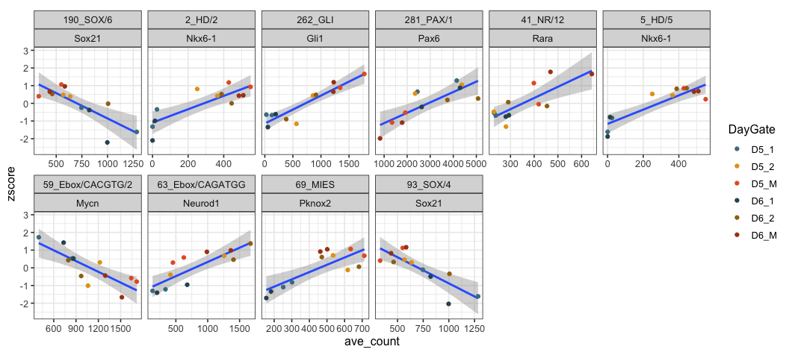
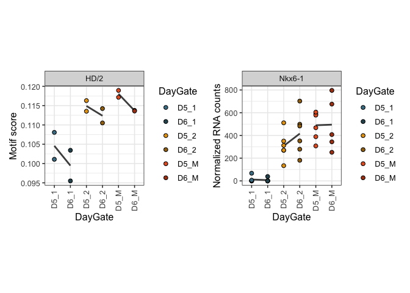
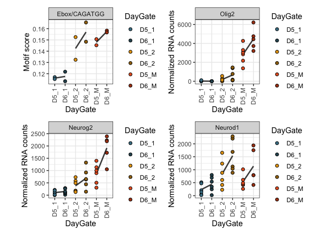

Footprinting across p0-M
================

## Footprinting differences within the shared chromatin landscape of p0-M

``` r
rm(list=ls())

library(RColorBrewer)
library(tidyverse)
library(genomation)
library(matrixStats)
library(ComplexHeatmap)
library(readxl)
library(broom)
library(patchwork)
```

### Input data

Ouput of bindetect is in
`BINDetect_25conditions_arch/bindetect_results.txt`

Motif annotation excel file was downloaded from Vierstra’s [motif
clustering](https://www.vierstra.org/resources/motif_clustering#downloads)

Archetype to possible genes lookup table
`lookup_motif_gene_archetype_21-11-23.csv` is custom made.

``` r
Motif_preds_tabl <- read.table("/Users/delasj/Documents/BriscoeLab/project_DV_ATAC_reproduce_analysis/inputs_footprinting/bindetect_results.txt",header=T,sep="\t",stringsAsFactors=F)
```

Clean up table and keep relevant samples.

``` r
Motif_scores <- Motif_preds_tabl %>%
  select(c("output_prefix" ,"name","motif_id","cluster", "motif_logo","total_tfbs",contains("_score"))) %>%
  select(-contains("_3_mean_score")) %>%
  select(-contains("NMP_mean_score"))
```

### table to group motifs to archetypes

``` r
archetypes_clusterid <- read_excel("/Users/delasj/Documents/BriscoeLab/project_DV_ATAC_reproduce_analysis/inputs_footprinting/motif_annotations.xlsx",2)  
archtypes_names <- read_excel("/Users/delasj/Documents/BriscoeLab/project_DV_ATAC_reproduce_analysis/inputs_footprinting/motif_annotations.xlsx",1)  

archtypes_2_motifs <- archetypes_clusterid %>% select(c("Cluster_ID","Motif","Database","Consensus")) %>%
  left_join(archtypes_names %>% select(c("Cluster_ID","Name","DBD","Seed_motif")), by="Cluster_ID")
archtypes_2_motifs$Cluster_ID <- as.character(archtypes_2_motifs$Cluster_ID)
```

### Archetype to possible TFs

``` r
gene_motifs_cluster <- read.csv("/Users/delasj/Documents/BriscoeLab/project_DV_ATAC_reproduce_analysis/inputs_footprinting/lookup_motif_gene_archetype_21-11-23.csv", stringsAsFactors =FALSE,
                                colClasses=c("character","character"))
```

### Gene expression

``` r
gene_exp <- read.csv("/Users/delasj/Documents/BriscoeLab/project_DV_ATAC_reproduce_analysis/outputs_rna_1/RNA_normCounts_filter1.csv", stringsAsFactors =FALSE )
```

### My colors and other settings

``` r
# Annotated heatmap with selected colors
hm_colors = colorRampPalette(rev(brewer.pal(n = 11, name = "RdBu")))(100)

# sample order etc
sorted.DayGate <- c("D3_NMP","D4_1","D4_2","D4_M","D4_3",
                    "D5_1","D5_2","D5_M","D5_3",
                    "D6_1","D6_2","D6_M","D6_3")

sorted.samples <- c("D3_0_NMP","D4_0_1","D4_10_1","D5_0_1","D5_10_1","D6_0_1","D6_10_1",
                   "D4_10_2","D4_100_2","D5_10_2","D5_100_2","D6_10_2","D6_100_2",
                   "D4_100_M","D4_500_M","D5_100_M","D5_500_M","D6_100_M","D6_500_M",
                   "D4_100_3","D4_500_3","D5_100_3","D5_500_3","D6_100_3","D6_500_3")

colorJD <- c("#477d92","#e5a114","#e3602b",
            "#2e525e","#9f7113","#ab4117")
```

## Score subseting

### Filter most variable as the BINDetect volcano plot does

The volcano plots shows y\_min = np.percentile(yvalues\[yvalues \> 0\],
5) \#5% smallest pvalues x\_min, x\_max = np.percentile(xvalues, \[5,
95\]) \#5% smallest and largest changes

Filter lowest pval and largest changes *per* comparison

``` r
scores_plotTop <- Motif_preds_tabl %>% 
  select(c("output_prefix",ends_with("_score"))) %>%
  select(-contains("_3_mean_score")) %>%
  select(-contains("NMP_mean_score")) %>%
  select(-starts_with("D4")) %>%
  gather(quant_item, value,ends_with("_score"))

scores_plot_topchanges <- Motif_preds_tabl %>%
  select("output_prefix", ends_with("_change")) %>%
  gather(item_changes, value_change, ends_with("_change")) %>% 
  group_by(item_changes) %>%
  mutate(value_abs_change = abs(value_change)) %>%
  top_frac(0.05,value_abs_change) %>%
  ungroup() %>%
  spread(item_changes, value_change)

scores_plot_topovalues <- Motif_preds_tabl %>%
  select("output_prefix", ends_with("_pvalue")) %>%
  gather(item_pvalue, value_pvalue, ends_with("_pvalue")) %>% 
  group_by(item_pvalue) %>%
  top_frac(-0.05,value_pvalue) %>%
  ungroup() %>%
  spread(item_pvalue, value_pvalue)
```

### Most variable motifs

Get the most variable motifs and the archetype grouping

``` r
scores_plot <- Motif_preds_tabl %>% select(c("output_prefix","name","motif_id","cluster", ends_with("_score"))) %>%
  select(-contains("_3_mean_score")) %>%
  select(-contains("NMP_mean_score")) %>%
  select(-starts_with("D4"))

scores_subset <- scores_plot %>% 
  filter(output_prefix %in% as.character(scores_plot_topovalues$output_prefix) | output_prefix %in% as.character(scores_plot_topchanges$output_prefix)) 
```

Join most variable motifs into archetypes. The most variable motif is
left as representative. Export the table to have a record of which motif
was used.

``` r
#export this to know exactly which motif has been kept 
scores_subset_cluster_motifname = scores_subset %>%
  left_join(archtypes_2_motifs, by = c("motif_id"="Motif")) %>%
  mutate(Archetype=paste(Cluster_ID,Name,sep = "_")) %>%
  gather(sample, mean_score, ends_with("_score")) %>%
  group_by(output_prefix) %>%
  mutate(score_var = var(mean_score)) %>%
  ungroup() %>% group_by(Archetype) %>%
  top_n(1,score_var) %>%
  spread(sample,mean_score)

write.table(scores_subset_cluster_motifname, file="/Users/delasj/Documents/BriscoeLab/project_DV_ATAC_reproduce_analysis/outputs_footprinting_p0M/Footprint_scores_variable_archetypes_p0-M.txt", quote = FALSE, row.names = TRUE)
```

Keep the most variable motif score per archetype.

``` r
scores_subset_cluster = scores_subset %>%
  left_join(archtypes_2_motifs, by = c("motif_id"="Motif")) %>%
  mutate(Archetype=paste(Cluster_ID,Name,sep = "_")) %>%
  gather(sample, mean_score, ends_with("_score")) %>%
  group_by(output_prefix) %>%
  mutate(score_var = var(mean_score)) %>%
  ungroup() %>% group_by(Archetype) %>%
  top_n(1,score_var) %>%
  select(-score_var, -output_prefix, -name, -motif_id, -cluster, -Database) %>% # eliminate the name of the motif
  unique() %>%
  spread(sample,mean_score)

scores_1percluster_ann <- scores_subset_cluster %>%
  select(c("Archetype","DBD","Name","Cluster_ID", ends_with("_score"))) %>%
  remove_rownames() %>%
  column_to_rownames("Archetype") %>%
  select("DBD")
```

Calculate z-scores and shape the table for plotting

``` r
scores_subset_hm <- scores_subset_cluster %>%
  remove_rownames() %>%
  column_to_rownames("Archetype") %>% select(ends_with("_score")) 

scores_subset_hm_z <- t(scale(t(scores_subset_hm))) 

scores_subset_plot_z <- scores_subset_hm_z %>%
  as.data.frame() %>%
  rownames_to_column("Archetype")
  
scores_subset_plot_z_gather <- scores_subset_plot_z %>%
  gather("sample","zscore", ends_with("_score")) %>%
  mutate(sample=gsub("_mean_score","", sample),
         sample=factor(sample, levels = sorted.samples)) %>%
  separate(sample,into=c("Day","SAG","Gate"), sep="_", remove=FALSE) %>%
  mutate(Condition=paste(Day,SAG,Gate, sep="_"),
         DaySAG=paste(Day,SAG,sep = "_"),
         DayGate=paste(Day,Gate,sep="_")) %>%
  mutate(DayGate = factor(DayGate, levels = sorted.DayGate))
```

## Correlation with gene expression

Out of the most variable scores, which ones have a motif that could bind
them expressed in the same cell types?

``` r
gene_2_clusterID_all <- gene_motifs_cluster %>% select("Cluster_ID","mouse_genename") %>% unique()

gene_2_clusterID <- gene_2_clusterID_all %>% 
  filter(!is.na(mouse_genename))

gene_2_arch <- gene_2_clusterID %>%
  left_join(archtypes_2_motifs, by = "Cluster_ID") %>%
  mutate(Archetype=paste(Cluster_ID,Name,sep = "_"))
```

Clean tables. There are a lot of very low counts genes that we filter
out.

``` r
# Only keep genes where at least 1 Condition has more than 100 normalized counts (average across reps)
gene_exp_clean <- gene_exp %>%
  dplyr::rename(genename=X) %>%
  gather(sample, norm_counts, starts_with("D")) %>%
  mutate(sample=gsub("\\.","_", sample)) %>%
  separate(sample,into=c("Day","SAG","Gate","Rep"), sep="_") %>%
  mutate(Condition=paste(Day,SAG,Gate, sep="_")) %>%
  group_by(Condition, genename) %>%
  summarise(ave_count = mean(norm_counts), .groups="keep") %>%
  spread(Condition, ave_count) %>%
  filter(if_any(where(is.numeric), ~ .x > 100)) %>%
  gather(Condition, ave_count, starts_with("D"))


zscores_arch_clean <- scores_subset_plot_z_gather %>% 
  separate(Archetype, into = c("Cluster_ID","Cluster_name"), sep = "_", remove = FALSE) 

# archtypes that still have genes
gene_2_arch_expressionfiltered = gene_2_arch %>%
  filter(mouse_genename %in% gene_exp_clean$genename)
```

To save a long list of correlations

``` r
get_reg_fit_arch_RNA <- function(x){
  
  clean_x = gsub("/","-",x)
  
  sub_zscores = zscores_arch_clean %>%
  filter(Archetype==x)
  
  sub_genes = gene_2_arch %>% filter(Archetype==x)
  
  sub_exp = gene_exp_clean %>% filter(genename %in% as.character(sub_genes$mouse_genename))
  
  sub_plot = sub_zscores %>%
    left_join(sub_exp, by = c("sample"="Condition")) 

  sub_corr <- sub_plot %>%
    group_by(genename) %>%
    mutate(arch2gene_corr = cor(zscore,ave_count)) %>%
    select(Archetype,Cluster_ID,Cluster_name,genename,arch2gene_corr) %>%
    unique()
  
  sub_fit <- sub_plot %>%
    group_by(genename) %>%
    do(fitgene =  glance(lm(zscore ~ ave_count, data = .))) %>%
    unnest(fitgene) %>%
    mutate(Archetype=x)
  
  sub_fit_corr <- sub_fit %>%
    inner_join(sub_corr, by=c("genename","Archetype"))

  sub_fit_corr
} 

top_arch <- intersect(zscores_arch_clean$Archetype, gene_2_arch_expressionfiltered$Archetype) %>% unique() 

Arch_gene_fit_all <- lapply(top_arch, get_reg_fit_arch_RNA)
```

    ## Warning in cor(zscore, ave_count): the standard deviation is zero

``` r
Arch_gene_fit_table <- do.call(rbind,Arch_gene_fit_all)
```

### Plot the top Correlated

Get the top archetypes-gene from Arch\_gene\_fit\_table

Go back to function-all-cor-fits and get the full table

``` r
# this correlation cutoff is arbitrary
Top_fit <- Arch_gene_fit_table %>%
  dplyr::filter(adj.r.squared > 0.6)


top_sub_zscores = zscores_arch_clean %>%
  filter(Archetype %in% Top_fit$Archetype)
  
top_sub_genes = gene_2_arch %>% filter(Archetype%in% Top_fit$Archetype & mouse_genename %in% Top_fit$genename) %>%
  select(-Motif,-Database,-Consensus) %>% unique()

top_sub_exp = top_sub_genes %>%
  left_join(gene_exp_clean, by = c("mouse_genename"="genename"))

top_sub_plot = top_sub_zscores %>%
  left_join(top_sub_exp, by = c("Archetype","Condition"))


ggplot(top_sub_plot, aes(x=ave_count, y=zscore, group=mouse_genename)) +
  geom_smooth(method=lm, formula = y ~ x) +
  geom_point(aes(color=DayGate)) +
  scale_color_manual(values = colorJD) +
  facet_wrap(Archetype ~ mouse_genename, scales = "free_x", ncol = 6) +
  theme_bw(base_size = 12) +
  theme(aspect.ratio = 1)
```

<!-- -->

As much as I love this score vs RNA plots, others don’t so much.

## Plot the RNA and the motif scores side by side for fig

The lines are just to help visualize the days together

``` r
#ordered by gate
sorted.DayGate2 <- c("D3_NMP","D4_1","D5_1","D6_1",
                     "D4_2","D5_2","D6_2",
                     "D4_M","D5_M","D6_M",
                     "D4_3","D5_3","D6_3")
#ordered by gate
colorJD2 <- c("#477d92","#2e525e",
              "#e5a114","#9f7113",
              "#e3602b","#ab4117",
              "#009640","#044a23")
# 3 colors ordered by gate
colorJD3 <- c("#477d92","#e5a114","#e3602b","#009640")


# Select days to show the scores
scores_subset_alldays <- Motif_preds_tabl %>%  
  select(c("output_prefix","name","motif_id","cluster", ends_with("_score"))) %>% 
  select(-contains("_3_mean_score")) %>%
  select(-contains("NMP_mean_score")) %>%
  select(-starts_with("D4")) 
  
# join to archetypes, keep most variable score
scores_subset_cluster_top_alldays = scores_subset_alldays %>%
  left_join(archtypes_2_motifs, by = c("motif_id"="Motif")) %>%
  mutate(Archetype=paste(Cluster_ID,Name,sep = "_")) %>%
  gather(sample, mean_score, ends_with("_score")) %>%
  group_by(output_prefix) %>%
  mutate(score_var = var(mean_score)) %>%
  ungroup() %>% group_by(Archetype) %>%
  top_n(1,score_var) %>%
  select(-score_var, -output_prefix, -name, -motif_id, -cluster, -Database) %>% # eliminate the name of the motif
  unique() %>%
  mutate(sample=gsub("_mean_score","", sample),
         sample=factor(sample, levels = sorted.samples)) %>%
  separate(sample,into=c("Day","SAG","Gate"), sep="_", remove=FALSE) %>%
  mutate(Condition=paste(Day,SAG,Gate, sep="_"),
         DaySAG=paste(Day,SAG,sep = "_"),
         DayGate=paste(Day,Gate,sep="_")) %>%
  mutate(DayGate = factor(DayGate, levels = sorted.DayGate2))

counts_clean <- gene_exp %>%
  select(-starts_with(c("D3","D4"))) %>%
  dplyr::rename(genename=X) %>%
  gather(sample, norm_counts, starts_with("D")) %>%
  mutate(sample=gsub("\\.","_", sample)) %>%
  separate(sample,into=c("Day","SAG","Gate","Rep"), sep="_") %>%
  filter(Gate != "3") %>%
  mutate(Condition=paste(Day,SAG,Gate, sep="_"),
         DayGate=paste(Day,Gate,sep="_")) %>%
  mutate(DayGate = factor(DayGate, levels = sorted.DayGate2),
         Condition=factor(Condition, levels = sorted.samples))


archetype = "2_HD/2"
gene="Nkx6-1"

sub_zscores = scores_subset_cluster_top_alldays %>% separate(Archetype, into = c("Cluster_ID","Cluster_name"), sep = "_", remove = FALSE) %>%
  filter(Archetype==archetype)

sub_counts_clean <- counts_clean %>% filter(genename == gene)


p1 <- ggplot(sub_counts_clean, aes(x=DayGate, y=norm_counts, group=Gate)) +
  geom_smooth(se = FALSE, method = lm, color="grey30") +
  geom_point(aes(fill=DayGate), shape=21, size=2) +
  scale_fill_manual(values = colorJD2) +
  facet_wrap( ~ genename, scales = "free_x") +
  ylab("Normalized RNA counts") +
  theme_bw(base_size = 12) +
  theme(aspect.ratio = 1,axis.text.x = element_text(angle = 90, vjust = 0.5, hjust=1))

p2 <- ggplot(sub_zscores, aes(x=DayGate, y=mean_score, group=Gate)) +
  geom_smooth(se = FALSE, method = lm, color="grey30") +
  geom_point(aes(fill=DayGate), shape=21, size=2) +
  scale_fill_manual(values = colorJD2) +
  facet_wrap( ~ Cluster_name, scales = "free_x") +
  ylab("Motif score") +
  theme_bw(base_size = 12) +
  theme(aspect.ratio = 1,axis.text.x = element_text(angle = 90, vjust = 0.5, hjust=1))

p2 + p1
```

    ## `geom_smooth()` using formula 'y ~ x'
    ## `geom_smooth()` using formula 'y ~ x'

<!-- -->

``` r
archetype = "281_PAX/1"
gene="Pax6"

sub_zscores = scores_subset_cluster_top_alldays %>% separate(Archetype, into = c("Cluster_ID","Cluster_name"), sep = "_", remove = FALSE) %>%
  filter(Archetype==archetype)

sub_counts_clean <- counts_clean %>% filter(genename == gene)

p1 <- ggplot(sub_counts_clean, aes(x=DayGate, y=norm_counts, group=Gate)) +
  geom_smooth(se = FALSE, method = lm, color="grey30") +
  geom_point(aes(fill=DayGate), shape=21, size=2) +
  scale_fill_manual(values = colorJD2) +
  facet_wrap( ~ genename, scales = "free_x") +
  ylab("Normalized RNA counts") +
  theme_bw(base_size = 12) +
  theme(aspect.ratio = 1,axis.text.x = element_text(angle = 90, vjust = 0.5, hjust=1))

p2 <- ggplot(sub_zscores, aes(x=DayGate, y=mean_score, group=Gate)) +
  geom_smooth(se = FALSE, method = lm, color="grey30") +
  geom_point(aes(fill=DayGate), shape=21, size=2) +
  scale_fill_manual(values = colorJD2) +
  facet_wrap( ~ Cluster_name, scales = "free_x") +
  ylab("Motif score") +
  theme_bw(base_size = 12) +
  theme(aspect.ratio = 1,axis.text.x = element_text(angle = 90, vjust = 0.5, hjust=1))

p2+p1
```

    ## `geom_smooth()` using formula 'y ~ x'
    ## `geom_smooth()` using formula 'y ~ x'

<!-- -->

``` r
archetype = "63_Ebox/CAGATGG"
gene="Olig2"

sub_zscores = scores_subset_cluster_top_alldays %>% separate(Archetype, into = c("Cluster_ID","Cluster_name"), sep = "_", remove = FALSE) %>%
  filter(Archetype==archetype)

sub_counts_clean <- counts_clean %>% filter(genename == gene)


p1 <- ggplot(sub_counts_clean, aes(x=DayGate, y=norm_counts, group=Gate)) +
  geom_smooth(se = FALSE, method = lm, color="grey30") +
  geom_point(aes(fill=DayGate), shape=21, size=2) +
  scale_fill_manual(values = colorJD2) +
  facet_wrap( ~ genename, scales = "free_x") +
  ylab("Normalized RNA counts") +
  theme_bw(base_size = 12) +
  theme(aspect.ratio = 1,axis.text.x = element_text(angle = 90, vjust = 0.5, hjust=1))

p2 <- ggplot(sub_zscores, aes(x=DayGate, y=mean_score, group=Gate)) +
  geom_smooth(se = FALSE, method = lm, color="grey30") +
  geom_point(aes(fill=DayGate), shape=21, size=2) +
  scale_fill_manual(values = colorJD2) +
  facet_wrap( ~ Cluster_name, scales = "free_x") +
  ylab("Motif score") +
  theme_bw(base_size = 12) +
  theme(aspect.ratio = 1,axis.text.x = element_text(angle = 90, vjust = 0.5, hjust=1))


gene="Neurog2"
sub_counts_clean <- counts_clean %>% filter(genename == gene)

p3 <- ggplot(sub_counts_clean, aes(x=DayGate, y=norm_counts, group=Gate)) +
  geom_smooth(se = FALSE, method = lm, color="grey30") +
  geom_point(aes(fill=DayGate), shape=21, size=2) +
  scale_fill_manual(values = colorJD2) +
  facet_wrap( ~ genename, scales = "free_x") +
  ylab("Normalized RNA counts") +
  theme_bw(base_size = 12) +
  theme(aspect.ratio = 1,axis.text.x = element_text(angle = 90, vjust = 0.5, hjust=1))


gene="Neurod1"
sub_counts_clean <- counts_clean %>% filter(genename == gene)
p4 <- ggplot(sub_counts_clean, aes(x=DayGate, y=norm_counts, group=Gate)) +
  geom_smooth(se = FALSE, method = lm, color="grey30") +
  geom_point(aes(fill=DayGate), shape=21, size=2) +
  scale_fill_manual(values = colorJD2) +
  facet_wrap( ~ genename, scales = "free_x") +
  ylab("Normalized RNA counts") +
  theme_bw(base_size = 12) +
  theme(aspect.ratio = 1,axis.text.x = element_text(angle = 90, vjust = 0.5, hjust=1))


p2+p1+p3+p4
```

    ## `geom_smooth()` using formula 'y ~ x'
    ## `geom_smooth()` using formula 'y ~ x'
    ## `geom_smooth()` using formula 'y ~ x'
    ## `geom_smooth()` using formula 'y ~ x'

<!-- -->

``` r
sessionInfo()
```

    ## R version 3.6.3 (2020-02-29)
    ## Platform: x86_64-apple-darwin15.6.0 (64-bit)
    ## Running under: macOS Catalina 10.15.7
    ## 
    ## Matrix products: default
    ## BLAS:   /Library/Frameworks/R.framework/Versions/3.6/Resources/lib/libRblas.0.dylib
    ## LAPACK: /Library/Frameworks/R.framework/Versions/3.6/Resources/lib/libRlapack.dylib
    ## 
    ## locale:
    ## [1] en_GB.UTF-8/en_GB.UTF-8/en_GB.UTF-8/C/en_GB.UTF-8/en_GB.UTF-8
    ## 
    ## attached base packages:
    ## [1] grid      stats     graphics  grDevices utils     datasets  methods  
    ## [8] base     
    ## 
    ## other attached packages:
    ##  [1] patchwork_1.1.1      broom_0.7.12         readxl_1.4.0        
    ##  [4] ComplexHeatmap_2.2.0 matrixStats_0.61.0   genomation_1.18.0   
    ##  [7] forcats_0.5.1        stringr_1.4.0        dplyr_1.0.8         
    ## [10] purrr_0.3.4          readr_2.1.2          tidyr_1.2.0         
    ## [13] tibble_3.1.6         ggplot2_3.3.5        tidyverse_1.3.1     
    ## [16] RColorBrewer_1.1-3  
    ## 
    ## loaded via a namespace (and not attached):
    ##  [1] nlme_3.1-153                bitops_1.0-7               
    ##  [3] fs_1.5.2                    lubridate_1.8.0            
    ##  [5] httr_1.4.2                  GenomeInfoDb_1.22.1        
    ##  [7] tools_3.6.3                 backports_1.4.1            
    ##  [9] utf8_1.2.2                  R6_2.5.1                   
    ## [11] KernSmooth_2.23-20          mgcv_1.8-38                
    ## [13] DBI_1.1.2                   BiocGenerics_0.32.0        
    ## [15] colorspace_2.0-3            GetoptLong_1.0.5           
    ## [17] seqPattern_1.18.0           withr_2.5.0                
    ## [19] tidyselect_1.1.2            compiler_3.6.3             
    ## [21] cli_3.2.0                   rvest_1.0.2                
    ## [23] Biobase_2.46.0              xml2_1.3.3                 
    ## [25] DelayedArray_0.12.3         labeling_0.4.2             
    ## [27] rtracklayer_1.46.0          scales_1.1.1               
    ## [29] digest_0.6.29               Rsamtools_2.2.3            
    ## [31] rmarkdown_2.13              XVector_0.26.0             
    ## [33] pkgconfig_2.0.3             htmltools_0.5.2            
    ## [35] plotrix_3.8-2               highr_0.9                  
    ## [37] dbplyr_2.1.1                fastmap_1.1.0              
    ## [39] BSgenome_1.54.0             GlobalOptions_0.1.2        
    ## [41] rlang_1.0.2                 rstudioapi_0.13            
    ## [43] impute_1.60.0               farver_2.1.0               
    ## [45] shape_1.4.6                 generics_0.1.2             
    ## [47] jsonlite_1.8.0              BiocParallel_1.20.1        
    ## [49] RCurl_1.98-1.6              magrittr_2.0.3             
    ## [51] GenomeInfoDbData_1.2.2      Matrix_1.3-2               
    ## [53] Rcpp_1.0.8.3                munsell_0.5.0              
    ## [55] S4Vectors_0.24.4            fansi_1.0.3                
    ## [57] lifecycle_1.0.1             stringi_1.7.6              
    ## [59] yaml_2.3.5                  SummarizedExperiment_1.16.1
    ## [61] zlibbioc_1.32.0             plyr_1.8.7                 
    ## [63] parallel_3.6.3              crayon_1.5.1               
    ## [65] lattice_0.20-45             splines_3.6.3              
    ## [67] Biostrings_2.54.0           haven_2.4.3                
    ## [69] circlize_0.4.14             hms_1.1.1                  
    ## [71] knitr_1.38                  pillar_1.7.0               
    ## [73] GenomicRanges_1.38.0        rjson_0.2.20               
    ## [75] reshape2_1.4.4              stats4_3.6.3               
    ## [77] reprex_2.0.1                XML_3.99-0.3               
    ## [79] glue_1.6.2                  evaluate_0.15              
    ## [81] data.table_1.14.2           modelr_0.1.8               
    ## [83] png_0.1-7                   vctrs_0.4.0                
    ## [85] tzdb_0.3.0                  cellranger_1.1.0           
    ## [87] gtable_0.3.0                clue_0.3-60                
    ## [89] assertthat_0.2.1            xfun_0.30                  
    ## [91] gridBase_0.4-7              GenomicAlignments_1.22.1   
    ## [93] IRanges_2.20.2              cluster_2.1.2              
    ## [95] ellipsis_0.3.2
