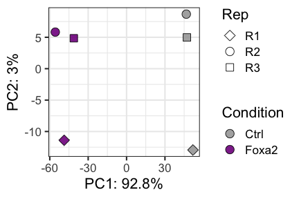

ATACseq upon Foxa2 induction
================

# ATAC analysis of inducible Foxa2 vs control

``` r
rm(list=ls())

library(DESeq2)
library(RColorBrewer)
library(tidyverse)
```

## Load data

Counts table generated by nf-core/atacseq in:
`results/bwa/mergedLibrary/macs/broadPeak/consensus/`

``` r
#counts table
count_table_full <- read.table(file="/Users/delasj/Documents/BriscoeLab/project_DV_ATAC_reproduce_analysis/inputs_ifoxa2-atac_1/consensus_peaks.mLb.clN.featureCounts.txt",header=TRUE, stringsAsFactors = FALSE)


# clean colnames
colnames(count_table_full) <- gsub(".mLb.clN.bam","",colnames(count_table_full))


# we do not need coordinates
count_table <- count_table_full %>%
  select("Geneid", starts_with("mCh"))

colnames(count_table) <- gsub("mCh.","",colnames(count_table))
```

## Colors and shapes

``` r
Foxa2colors <- c("#a6a6a6","#82008e","#5e0067")
shapes5_manual = c(25,21,22,23,24) # these are filled
shapes4_fill_manual = c(23,21,22,24)
```

## Differential analysis

``` r
count_matrix <- count_table %>%
  column_to_rownames("Geneid")

## Make metadata file for DESeq

genecolData_first <- data.frame(Sample_ID = colnames(count_matrix))
genecolData_first <- genecolData_first %>% 
  separate(Sample_ID,into=c("Condition","Rep"), sep="_", remove=FALSE)
genecolData_first <- as.data.frame(unclass(genecolData_first))


dds <- DESeqDataSetFromMatrix(countData = count_matrix,
                              colData = genecolData_first,
                              design = ~ Condition)

dds <- DESeq(dds)
```

    ## estimating size factors

    ## estimating dispersions

    ## gene-wise dispersion estimates

    ## mean-dispersion relationship

    ## final dispersion estimates

    ## fitting model and testing

``` r
vsd <- varianceStabilizingTransformation(dds,blind = FALSE)
```

## Export files

Export normalized tables for plotting elsewhere

``` r
dds_counts <- counts(dds, normalized = TRUE)
vsd_data <- assay(vsd)
dds_results <- results(dds)

# write.table(dds_counts, file = "1_output_tables/consensus_peaks.mLb.clN.normCounts.txt", quote = FALSE, row.names = TRUE)
# write.csv(vsd_data, file = "1_output_tables/consensus_peaks.mLb.vsd.csv", quote = FALSE)
```

## Plot PCAs

This should reveal any major batch effects. It will not too informative
otherwise.

``` r
# calculate the variance for each gene
rv <- rowVars(vsd_data)
# select the ntop genes by variance
ntop=30000
select <- order(rv, decreasing=TRUE)[seq_len(min(ntop, length(rv)))]


t_vsd <- t(vsd_data[select,])
vsd_pca <- prcomp(t_vsd, retx=TRUE, scale. = FALSE)


var_explained <-vsd_pca$sdev^2/sum(vsd_pca$sdev^2)

vsd_pca_plot <- vsd_pca$x %>% 
  as.data.frame %>%
  rownames_to_column("Sample") %>%
  separate(Sample,into=c("Condition","Rep"), sep="_", remove=FALSE)


ggplot(vsd_pca_plot, aes(x=PC1,y=PC2,fill=Condition,shape=Rep)) +
  scale_fill_manual(values = Foxa2colors) +
  geom_point(size=4, alpha=0.9) +
  guides(fill = guide_legend(override.aes=list(shape=21))) +
  scale_shape_manual(values = shapes4_fill_manual) +
  labs(x=paste0("PC1: ",round(var_explained[1]*100,1),"%"),
       y=paste0("PC2: ",round(var_explained[2]*100,1),"%")) +
  theme_bw(base_size=16)
```

<!-- -->

## MA plot

Plot differentially accessible elements vs baseMean

``` r
# color significant
results_sub_plot1 <- dds_results %>%
  as.data.frame() %>%
  mutate(color_sig=case_when(padj < 0.1 & padj > 0.01 ~ "under01",
                      padj < 0.01 & padj > 0.001 ~ "under001",
                      padj < 0.001 & padj >0 ~ "under0001",
                      TRUE ~ "over01"))
      
threshold <- 7
table(results_sub_plot1$color_sig)
```

    ## 
    ##    over01 under0001  under001   under01 
    ##     41053     35710     11790     19759

``` r
n_diff_1 <- results_sub_plot1 %>%
        mutate(Sig0001 = case_when(padj < 0.001 & log2FoldChange > 0 ~ "up",
                                   padj < 0.001 & log2FoldChange < 0 ~ "down"))
table(n_diff_1$Sig0001)
```

    ## 
    ##  down    up 
    ##  6374 29336

``` r
ggplot(results_sub_plot1, aes(x=baseMean, y=log2FoldChange, color=color_sig)) +
          geom_point(size=1) +
          geom_point(data=results_sub_plot1[results_sub_plot1$log2FoldChange > threshold,],
                   aes(x=baseMean, y=threshold), shape = 2, colour="#d83a00") +
          # geom_point(data=results_sub_plot1[results_sub_plot1$log2FoldChange < -threshold,],
          #          aes(x=baseMean, y=-threshold), shape = 2, colour="#d83a00") +
          ylim(-threshold,threshold) +
          scale_x_log10() +
          scale_color_manual(values = c("gray30","#d83a00","#ff9b76","#ffd4c4")) +
          ylab(paste0("log2 Fold Change Foxa2 vs Ctrl ATAC")) +
          ggtitle(paste0("Results Foxa2 vs Ctrl")) +
          theme_bw() 
```

    ## Warning: Removed 104 rows containing missing values (geom_point).

<!-- -->

``` r
library(ggrastr)
# ggplot(results_sub_plot1, aes(x=baseMean, y=log2FoldChange, color=color_sig)) +
#           rasterise(geom_poin t(size=1),dpi = 300) +
#           geom_point(data=results_sub_plot1[results_sub_plot1$log2FoldChange > threshold,],
#                    aes(x=baseMean, y=threshold), shape = 2, colour="#d83a00") +
#           # geom_point(data=results_sub_plot1[results_sub_plot1$log2FoldChange < -threshold,],
#           #          aes(x=baseMean, y=-threshold), shape = 2, colour="#d83a00") +
#           ylim(-threshold,threshold) +
#           scale_x_log10() +
#           scale_color_manual(values = c("gray30","#d83a00","#ff9b76","#ffd4c4")) +
#           ylab(paste0("log2 Fold Change Foxa2 vs Ctrl ATAC")) +
#           ggtitle(paste0("Results Foxa2 vs Ctrl")) +
#           theme_bw() 
```

### Export diff acces peaks to overlap with WT clusters

Export bed files to perform BED intersect. Export deseq results with
annotation to explore.

``` r
Foxa2_up <- dds_results %>% 
  as.data.frame() %>%
  filter(padj < 0.001 & log2FoldChange > 0) %>%
  rownames_to_column("Geneid")

Foxa2_down <- dds_results %>% 
  as.data.frame() %>%
  filter(padj < 0.001 & log2FoldChange < 0) %>%
  rownames_to_column("Geneid")


Foxa2_up_bed <- count_table_full %>%
  select(Chr,Start,End, Strand,Geneid) %>%
  filter(Geneid %in% Foxa2_up$Geneid)

Foxa2_down_bed <- count_table_full %>%
  select(Chr,Start,End, Strand,Geneid) %>%
  filter(Geneid %in% Foxa2_down$Geneid)

# write.csv(Foxa2_up, file="1_outputs_DESeq2results/Foxa2_up_results.csv", row.names = F, quote = F)
# write.csv(Foxa2_down, file="1_outputs_DESeq2results/Foxa2_down_results.csv", row.names = F, quote = F)
# 
# 
# write.table(Foxa2_up_bed, file="1_outputs_beds/Foxa2_up.bed",sep="\t", row.names = F, col.names = F, quote = F)
# write.table(Foxa2_down_bed, file="1_outputs_beds/Foxa2_down.bed",sep="\t", row.names = F, col.names = F, quote = F)
```

``` r
sessionInfo()
```

    ## R version 3.6.3 (2020-02-29)
    ## Platform: x86_64-apple-darwin15.6.0 (64-bit)
    ## Running under: macOS Catalina 10.15.7
    ## 
    ## Matrix products: default
    ## BLAS:   /Library/Frameworks/R.framework/Versions/3.6/Resources/lib/libRblas.0.dylib
    ## LAPACK: /Library/Frameworks/R.framework/Versions/3.6/Resources/lib/libRlapack.dylib
    ## 
    ## locale:
    ## [1] en_GB.UTF-8/en_GB.UTF-8/en_GB.UTF-8/C/en_GB.UTF-8/en_GB.UTF-8
    ## 
    ## attached base packages:
    ## [1] parallel  stats4    stats     graphics  grDevices utils     datasets 
    ## [8] methods   base     
    ## 
    ## other attached packages:
    ##  [1] ggrastr_1.0.1               forcats_0.5.1              
    ##  [3] stringr_1.4.0               dplyr_1.0.8                
    ##  [5] purrr_0.3.4                 readr_2.1.2                
    ##  [7] tidyr_1.2.0                 tibble_3.1.6               
    ##  [9] ggplot2_3.3.5               tidyverse_1.3.1            
    ## [11] RColorBrewer_1.1-3          DESeq2_1.26.0              
    ## [13] SummarizedExperiment_1.16.1 DelayedArray_0.12.3        
    ## [15] BiocParallel_1.20.1         matrixStats_0.61.0         
    ## [17] Biobase_2.46.0              GenomicRanges_1.38.0       
    ## [19] GenomeInfoDb_1.22.1         IRanges_2.20.2             
    ## [21] S4Vectors_0.24.4            BiocGenerics_0.32.0        
    ## 
    ## loaded via a namespace (and not attached):
    ##  [1] ggbeeswarm_0.6.0       colorspace_2.0-3       ellipsis_0.3.2        
    ##  [4] htmlTable_2.4.0        XVector_0.26.0         base64enc_0.1-3       
    ##  [7] fs_1.5.2               rstudioapi_0.13        farver_2.1.0          
    ## [10] bit64_4.0.5            AnnotationDbi_1.48.0   fansi_1.0.3           
    ## [13] lubridate_1.8.0        xml2_1.3.3             splines_3.6.3         
    ## [16] cachem_1.0.6           geneplotter_1.64.0     knitr_1.38            
    ## [19] Formula_1.2-4          jsonlite_1.8.0         broom_0.7.12          
    ## [22] annotate_1.64.0        cluster_2.1.2          dbplyr_2.1.1          
    ## [25] png_0.1-7              compiler_3.6.3         httr_1.4.2            
    ## [28] backports_1.4.1        assertthat_0.2.1       Matrix_1.3-2          
    ## [31] fastmap_1.1.0          cli_3.2.0              htmltools_0.5.2       
    ## [34] tools_3.6.3            gtable_0.3.0           glue_1.6.2            
    ## [37] GenomeInfoDbData_1.2.2 Rcpp_1.0.8.3           cellranger_1.1.0      
    ## [40] vctrs_0.4.0            xfun_0.30              rvest_1.0.2           
    ## [43] lifecycle_1.0.1        XML_3.99-0.3           zlibbioc_1.32.0       
    ## [46] scales_1.1.1           hms_1.1.1              yaml_2.3.5            
    ## [49] memoise_2.0.1          gridExtra_2.3          rpart_4.1.16          
    ## [52] latticeExtra_0.6-29    stringi_1.7.6          RSQLite_2.2.12        
    ## [55] highr_0.9              genefilter_1.68.0      checkmate_2.0.0       
    ## [58] rlang_1.0.2            pkgconfig_2.0.3        bitops_1.0-7          
    ## [61] evaluate_0.15          lattice_0.20-45        htmlwidgets_1.5.4     
    ## [64] labeling_0.4.2         bit_4.0.4              tidyselect_1.1.2      
    ## [67] magrittr_2.0.3         R6_2.5.1               generics_0.1.2        
    ## [70] Hmisc_4.6-0            DBI_1.1.2              pillar_1.7.0          
    ## [73] haven_2.4.3            foreign_0.8-76         withr_2.5.0           
    ## [76] survival_3.3-1         RCurl_1.98-1.6         nnet_7.3-17           
    ## [79] modelr_0.1.8           crayon_1.5.1           utf8_1.2.2            
    ## [82] tzdb_0.3.0             rmarkdown_2.13         jpeg_0.1-9            
    ## [85] locfit_1.5-9.4         grid_3.6.3             readxl_1.4.0          
    ## [88] data.table_1.14.2      blob_1.2.2             reprex_2.0.1          
    ## [91] digest_0.6.29          xtable_1.8-4           munsell_0.5.0         
    ## [94] beeswarm_0.4.0         vipor_0.4.5
