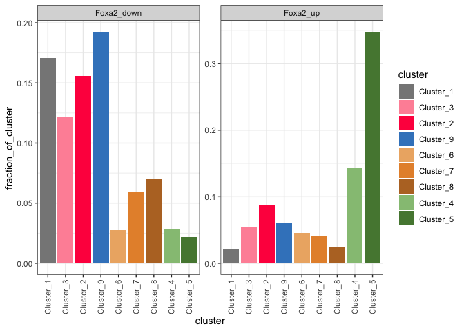

Overlap of ATAC clusters with regions opened in Foxa2 inducible or
control
================

## Analysis

Overlap between intervals of different clusters and the up or down
significant intervals in the inducible Foxa2

``` r
# Load all packages
rm(list=ls())

library(tidyverse)
library(RColorBrewer)
```

### Set dirs

``` r
workingdir="/Users/delasj/Documents/BriscoeLab/project_DV_ATAC_reproduce_analysis/"
subworkinput="inputs_ifoxa2-atac_2_overlaps/"
```

### Define colors

``` r
cluster_colors <- c("#878787","#ff284d","#ff93a6","#96c283","#55863f","#edb273","#e69138","#b8742c","#3d85c6")
```

## Intersects of the clusters and elements opened by Foxa2 or control

``` r
beds_import <- lapply(list.files(path = paste0(workingdir,subworkinput), pattern="*.bed", full.names=TRUE),function(x){
    data <- read.table(x, header = FALSE)
    data$ChIP <- gsub("__within__.*","",x)
    data$ChIP <- gsub(".*/","",data$ChIP)
    data$cluster <- gsub(".*__within__","",x)
    data$cluster <- gsub("\\.bed","",data$cluster)
    data
})

all_intersects <- do.call(rbind,beds_import)
```

## Import the overal beds

### Full beds for the clusters

``` r
fullbeds_import <- lapply(list.files(path = paste0(workingdir,"outputs_cats-atac_5_kmeans"), pattern="*bed", full.names=TRUE),function(x){
    data <- read.table(x, header = FALSE)
    data$cluster <- gsub("Intervals_","",x)
    data$cluster <- gsub("\\.bed","",data$cluster)
    data$cluster <- gsub(".*/","",data$cluster)
    data
})

full_beds <- do.call(rbind,fullbeds_import)
```

### Full beds for Foxa2 diff acc

``` r
fullchip_import <- lapply(list.files(path = paste0(workingdir,"outputs_ifoxa2-atac_1"), pattern="*.bed*", full.names=TRUE),function(x){
    data <- read.table(x, header = FALSE)
    data <- data %>% select(c("V1","V2","V3","V4"))
    data$ChIP <- gsub("\\.bed","",x)
    # data$ChIP <- gsub("\\.consensus_peaks\\.bed","",data$ChIP)
    data$ChIP <- gsub(".*/","",data$ChIP)
    data
})

full_chip <- do.call(rbind,fullchip_import)
```

## Fraction of Cluster occupied by ChIP

## Fraction of Chip calls within each cluster

Bedtools intersect -wa will report a (the interval in cluster) multiple
times if there are multiple overlaps.

``` r
intersects_sums = all_intersects %>%
  select(V4,ChIP,cluster) %>% 
  unique() %>%
  group_by(cluster, ChIP) %>%
  summarise(count=n(), .groups = 'keep')

cluster_sums = full_beds %>%
  group_by(cluster) %>%
  summarise(total=n(), .groups = 'keep')

chip_sums = full_chip %>%
  group_by(ChIP) %>%
  summarise(total=n(), .groups = 'keep')

intersect_full_counts <- intersects_sums %>%
  left_join(cluster_sums, by = "cluster") %>%
  dplyr::rename(cluster_n=total) %>%
  left_join(chip_sums, by = "ChIP") %>%
  dplyr::rename(chip_n=total)


intersect_full_prop <- intersect_full_counts %>%
  mutate(fraction_of_cluster=count/cluster_n,
         fraction_of_chip=count/chip_n,
         cluster_ChIP=paste(cluster, ChIP, sep = "__"))
```

## Proportions bar plots

### plot for figure

Fraction of elements in the cluster that overlap with elements in Foxa2
Up or Down

``` r
ggplot(intersect_full_prop %>% 
         mutate(cluster=factor(cluster, levels = c("Cluster_1","Cluster_3","Cluster_2","Cluster_9",
                                                   "Cluster_6","Cluster_7","Cluster_8","Cluster_4","Cluster_5"))), 
       aes(x=cluster, y=fraction_of_cluster, fill=cluster)) +
  geom_bar(stat = "identity", position = "stack") + 
  facet_wrap( ~ ChIP, scales = "free_y") +
  theme_bw() +
  scale_fill_manual(values = cluster_colors[c(1,3,2,9,6,7,8,4,5)]) +
  theme(axis.text.x = element_text(angle = 90, vjust = 0.5, hjust=1))
```

<!-- -->

``` r
sessionInfo()
```

    ## R version 3.6.3 (2020-02-29)
    ## Platform: x86_64-apple-darwin15.6.0 (64-bit)
    ## Running under: macOS Catalina 10.15.7
    ## 
    ## Matrix products: default
    ## BLAS:   /Library/Frameworks/R.framework/Versions/3.6/Resources/lib/libRblas.0.dylib
    ## LAPACK: /Library/Frameworks/R.framework/Versions/3.6/Resources/lib/libRlapack.dylib
    ## 
    ## locale:
    ## [1] en_GB.UTF-8/en_GB.UTF-8/en_GB.UTF-8/C/en_GB.UTF-8/en_GB.UTF-8
    ## 
    ## attached base packages:
    ## [1] stats     graphics  grDevices utils     datasets  methods   base     
    ## 
    ## other attached packages:
    ##  [1] RColorBrewer_1.1-3 forcats_0.5.1      stringr_1.4.0      dplyr_1.0.8       
    ##  [5] purrr_0.3.4        readr_2.1.2        tidyr_1.2.0        tibble_3.1.6      
    ##  [9] ggplot2_3.3.5      tidyverse_1.3.1   
    ## 
    ## loaded via a namespace (and not attached):
    ##  [1] tidyselect_1.1.2 xfun_0.30        haven_2.4.3      colorspace_2.0-3
    ##  [5] vctrs_0.4.0      generics_0.1.2   htmltools_0.5.2  yaml_2.3.5      
    ##  [9] utf8_1.2.2       rlang_1.0.2      pillar_1.7.0     glue_1.6.2      
    ## [13] withr_2.5.0      DBI_1.1.2        dbplyr_2.1.1     modelr_0.1.8    
    ## [17] readxl_1.4.0     lifecycle_1.0.1  munsell_0.5.0    gtable_0.3.0    
    ## [21] cellranger_1.1.0 rvest_1.0.2      evaluate_0.15    labeling_0.4.2  
    ## [25] knitr_1.38       tzdb_0.3.0       fastmap_1.1.0    fansi_1.0.3     
    ## [29] highr_0.9        broom_0.7.12     backports_1.4.1  scales_1.1.1    
    ## [33] jsonlite_1.8.0   farver_2.1.0     fs_1.5.2         hms_1.1.1       
    ## [37] digest_0.6.29    stringi_1.7.6    grid_3.6.3       cli_3.2.0       
    ## [41] tools_3.6.3      magrittr_2.0.3   crayon_1.5.1     pkgconfig_2.0.3 
    ## [45] ellipsis_0.3.2   xml2_1.3.3       reprex_2.0.1     lubridate_1.8.0 
    ## [49] assertthat_0.2.1 rmarkdown_2.13   httr_1.4.2       rstudioapi_0.13 
    ## [53] R6_2.5.1         compiler_3.6.3
