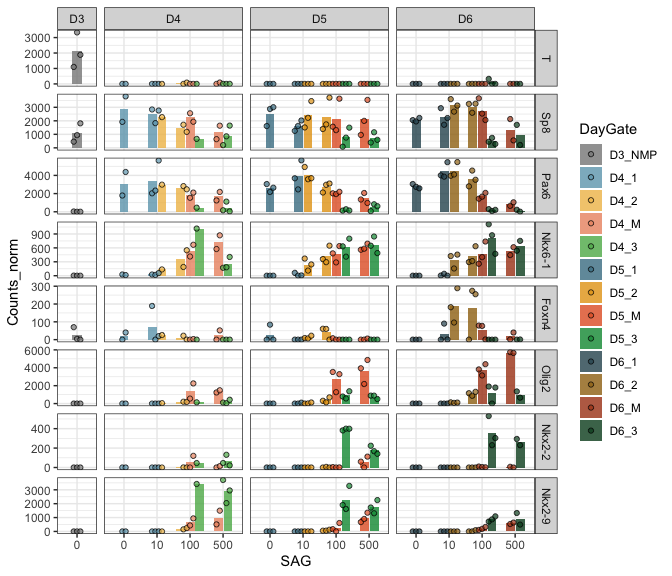
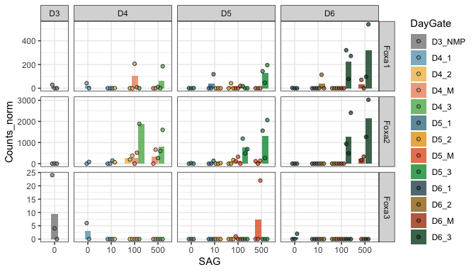

RNA-seq analysis
================

This is RNA-seq from PFA-fixed, permeabilized and sorted cells. Data
quality is limited.

``` r
rm(list=ls())

library(tidyverse)
library(DESeq2)
library(ggplot2)
library(RColorBrewer)
```

### Set dirs

``` r
workingdir="/Users/delasj/Documents/BriscoeLab/project_DV_ATAC_reproduce_analysis/"
subworkinput="inputs_rna_1/"
outdir="outputs_rna_1/"

ifelse(!dir.exists(file.path(workingdir,outdir)), dir.create(file.path(workingdir,outdir)), "Directory exists")
```

    ## [1] "Directory exists"

## Load data

Data generated by `R_gene_counts`

``` r
count.table <- read.table(file=paste0(workingdir,subworkinput,"Counts_DupR.featureCounts_custom.txt"),header=TRUE, stringsAsFactors = FALSE)

#clean header
colnames(count.table) <- gsub(".read1Aligned.sortedByCoord.out.markDups.bam","", colnames(count.table))
```

## Color and order

``` r
#order conditions
sorted.gate <- c("NMP","1","2","M","3")

sorted.DayGate <- c("D3_NMP","D4_1","D4_2","D4_M","D4_3",
                    "D5_1","D5_2","D5_M","D5_3",
                    "D6_1","D6_2","D6_M","D6_3")
colorJD <- c("#878787","#6da4ba","#f0be56","#ec936f","#5bb357",
             "#477d92","#e5a114","#e3602b","#009640",
             "#2e525e","#9f7113","#ab4117","#044a23")
shapes4_manual = c(18,15,16,17) # these are block
shapes5_manual = c(25,21,22,23,24) # these are filled
shapes4_fill_manual = c(23,21,22,24)
```

## Prep matrix with just genes

``` r
count.matrix <- count.table %>%
  select(c("GeneID",starts_with("D"))) %>%
  filter(!grepl("ERCC", GeneID)) %>%
  remove_rownames %>%
  column_to_rownames("GeneID")
```

## Differential analysis

``` r
## Make metadata file for DESeq
genecolData_first <- data.frame(Sample_ID = colnames(count.matrix))
genecolData_first <- genecolData_first %>% 
  separate(Sample_ID,into=c("Day","SAG","Gate","Rep"), sep="\\.", remove=FALSE) %>%
  mutate(Condition=paste(Day,SAG,Gate, sep="_"),
         DaySAG=paste(Day,SAG,sep = "_"),
         DayGate=paste(Day,Gate,sep="_"),
         Experiment=paste(SAG,Rep,sep="_")) 

genecolData_first <- as.data.frame(unclass(genecolData_first))


dds <- DESeqDataSetFromMatrix(countData = count.matrix,
                              colData = genecolData_first,
                              design = ~ Gate)
```

    ## Warning in DESeqDataSet(se, design = design, ignoreRank): some variables in
    ## design formula are characters, converting to factors

``` r
dds <- DESeq(dds)
```

    ## estimating size factors

    ## estimating dispersions

    ## gene-wise dispersion estimates

    ## mean-dispersion relationship

    ## final dispersion estimates

    ## fitting model and testing

    ## -- replacing outliers and refitting for 2336 genes
    ## -- DESeq argument 'minReplicatesForReplace' = 7 
    ## -- original counts are preserved in counts(dds)

    ## estimating dispersions

    ## fitting model and testing

``` r
vsd <- varianceStabilizingTransformation(dds,blind = FALSE)
```

Get tables and count normalized. Export data to use elsewhere.

``` r
vsd_data <- assay(vsd)
counts_data <- counts(dds, normalized = TRUE)
```

``` r
write.csv(counts_data, file=paste0(workingdir,outdir,"RNA_normCounts_filter1.csv"), quote=FALSE)
write.csv(vsd_data, file=paste0(workingdir,outdir,"RNA_vsd_filter1.csv"), quote=FALSE)
```

## Plot marker genes

Validate the sorted populations expressed the expected genes. Marker
genes from Delile et al. 

``` r
GOIs <- c("T","Sp8","Pax6","Nkx6-1","Foxn4","Olig2","Nkx2-2","Nkx2-9")

counts_data_sub <- count.matrix[GOIs,]

counts_data_sub_plot <- counts_data_sub %>%
  as.data.frame() %>%
  rownames_to_column("geneid") %>%
  gather(Sample_ID,Counts_norm, starts_with("D")) %>%
  separate(Sample_ID,into=c("Day","SAG","Gate","Rep"), sep="\\.", remove=FALSE) %>%
  mutate(Condition=paste(Day,SAG,Gate, sep="_"),
         DaySAG=paste(Day,SAG,sep = "_"),
         DayGate=paste(Day,Gate,sep="_"),
         Experiment=paste(SAG,Rep,sep="_")) %>%
  mutate(DayGate = factor(DayGate, levels = sorted.DayGate),
         geneid=factor(geneid, levels = GOIs))

ggplot(counts_data_sub_plot, aes(x=SAG,y=Counts_norm,fill=DayGate)) +
    stat_summary(aes(fill=DayGate),
     fun = mean, geom="bar", alpha=0.8,position=position_dodge2(width=0.9,preserve = "single")) +
    geom_point(aes(fill=DayGate), alpha=0.7, position = position_dodge2(width=0.9,preserve ="single"),color="black",shape=21) +
  scale_fill_manual(values = colorJD) +
  facet_grid(geneid ~ Day, scales = "free", space = "free_x") +
  theme_bw()
```

<!-- -->

## Plot Fox genes

``` r
GOIs <- c("Foxa1","Foxa2","Foxa3")

counts_data_sub <- count.matrix[GOIs,]

counts_data_sub_plot <- counts_data_sub %>%
  as.data.frame() %>%
  rownames_to_column("geneid") %>%
  gather(Sample_ID,Counts_norm, starts_with("D")) %>%
  separate(Sample_ID,into=c("Day","SAG","Gate","Rep"), sep="\\.", remove=FALSE) %>%
  mutate(Condition=paste(Day,SAG,Gate, sep="_"),
         DaySAG=paste(Day,SAG,sep = "_"),
         DayGate=paste(Day,Gate,sep="_"),
         Experiment=paste(SAG,Rep,sep="_")) %>%
  mutate(DayGate = factor(DayGate, levels = sorted.DayGate),
         geneid=factor(geneid, levels = GOIs))

ggplot(counts_data_sub_plot, aes(x=SAG,y=Counts_norm,fill=DayGate)) +
    stat_summary(aes(fill=DayGate),
     fun = mean, geom="bar", alpha=0.8,position=position_dodge2(width=0.9,preserve = "single")) +
    geom_point(aes(fill=DayGate), alpha=0.7, position = position_dodge2(width=0.9,preserve ="single"),color="black",shape=21) +
  scale_fill_manual(values = colorJD) +
  facet_grid(geneid ~ Day, scales = "free", space = "free_x") +
  theme_bw()
```

<!-- -->

``` r
sessionInfo()
```

    ## R version 4.2.1 (2022-06-23)
    ## Platform: x86_64-apple-darwin17.0 (64-bit)
    ## Running under: macOS Catalina 10.15.7
    ## 
    ## Matrix products: default
    ## BLAS:   /Library/Frameworks/R.framework/Versions/4.2/Resources/lib/libRblas.0.dylib
    ## LAPACK: /Library/Frameworks/R.framework/Versions/4.2/Resources/lib/libRlapack.dylib
    ## 
    ## locale:
    ## [1] en_GB.UTF-8/en_GB.UTF-8/en_GB.UTF-8/C/en_GB.UTF-8/en_GB.UTF-8
    ## 
    ## attached base packages:
    ## [1] stats4    stats     graphics  grDevices utils     datasets  methods  
    ## [8] base     
    ## 
    ## other attached packages:
    ##  [1] RColorBrewer_1.1-3          DESeq2_1.37.6              
    ##  [3] SummarizedExperiment_1.27.3 Biobase_2.57.1             
    ##  [5] MatrixGenerics_1.9.1        matrixStats_0.62.0         
    ##  [7] GenomicRanges_1.49.1        GenomeInfoDb_1.33.7        
    ##  [9] IRanges_2.31.2              S4Vectors_0.35.4           
    ## [11] BiocGenerics_0.43.4         forcats_0.5.2              
    ## [13] stringr_1.4.1               dplyr_1.0.10               
    ## [15] purrr_0.3.4                 readr_2.1.2                
    ## [17] tidyr_1.2.1                 tibble_3.1.8               
    ## [19] ggplot2_3.3.6               tidyverse_1.3.2            
    ## 
    ## loaded via a namespace (and not attached):
    ##  [1] bitops_1.0-7           fs_1.5.2               lubridate_1.8.0       
    ##  [4] bit64_4.0.5            httr_1.4.4             tools_4.2.1           
    ##  [7] backports_1.4.1        utf8_1.2.2             R6_2.5.1              
    ## [10] DBI_1.1.3              colorspace_2.0-3       withr_2.5.0           
    ## [13] tidyselect_1.1.2       bit_4.0.4              compiler_4.2.1        
    ## [16] cli_3.4.0              rvest_1.0.3            xml2_1.3.3            
    ## [19] DelayedArray_0.23.2    labeling_0.4.2         scales_1.2.1          
    ## [22] genefilter_1.79.0      digest_0.6.29          rmarkdown_2.16        
    ## [25] XVector_0.37.1         pkgconfig_2.0.3        htmltools_0.5.3       
    ## [28] highr_0.9              dbplyr_2.2.1           fastmap_1.1.0         
    ## [31] rlang_1.0.5            readxl_1.4.1           rstudioapi_0.14       
    ## [34] RSQLite_2.2.17         farver_2.1.1           generics_0.1.3        
    ## [37] jsonlite_1.8.0         BiocParallel_1.31.12   googlesheets4_1.0.1   
    ## [40] RCurl_1.98-1.8         magrittr_2.0.3         GenomeInfoDbData_1.2.8
    ## [43] Matrix_1.5-1           Rcpp_1.0.9             munsell_0.5.0         
    ## [46] fansi_1.0.3            lifecycle_1.0.2        stringi_1.7.8         
    ## [49] yaml_2.3.5             zlibbioc_1.43.0        blob_1.2.3            
    ## [52] grid_4.2.1             parallel_4.2.1         crayon_1.5.1          
    ## [55] lattice_0.20-45        splines_4.2.1          Biostrings_2.65.6     
    ## [58] haven_2.5.1            annotate_1.75.0        KEGGREST_1.37.3       
    ## [61] hms_1.1.2              locfit_1.5-9.6         knitr_1.40            
    ## [64] pillar_1.8.1           geneplotter_1.75.0     codetools_0.2-18      
    ## [67] reprex_2.0.2           XML_3.99-0.10          glue_1.6.2            
    ## [70] evaluate_0.16          modelr_0.1.9           png_0.1-7             
    ## [73] vctrs_0.4.1            tzdb_0.3.0             cellranger_1.1.0      
    ## [76] gtable_0.3.1           assertthat_0.2.1       cachem_1.0.6          
    ## [79] xfun_0.33              xtable_1.8-4           broom_1.0.1           
    ## [82] survival_3.4-0         googledrive_2.0.0      gargle_1.2.1          
    ## [85] memoise_2.0.1          AnnotationDbi_1.59.1   ellipsis_0.3.2
